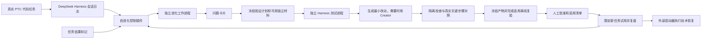

# Continually Self-Evolving DeepSeek Harness：第一期技术设计

> 状态：2026-09-19 新版适配方案，版本 1.7；新版运行验收待完成  
> 目标基线：DeepSeek Harness [`ddefc45`](https://github.com/deepseek-ai/deepseek-harness/tree/ddefc45fbc7f8e46dd73185e68295696d1297887)，`0.1.6-alpha.2`；当前实际运行目录仍为 `47f9438`  
> 版本证据与切换闸门：[上游兼容性核查](../research/2026-09-19-harness-upstream-compatibility.md)  
> 产品要求：[第一期产品设计](./2026-08-18-phase-1-product-design.md)  
> 权威决定：[项目决策记录](./2026-08-17-project-decision-log.md)

本版按 D-055～D-057 扩大改动范围并重写验证门槛。进化包括模型外的受管理 Memory、Skill、配置、上下文与检索策略和插件；MVP 优先真实关键步骤对照加有限试用，不承诺完整重放或普遍无退化。

## 1. 技术结论

第一期不修改 DeepSeek Harness 核心源码，也不维护分叉。实现为一个独立扩展项目，包含：

1. 一个普通 Cordis 自进化控制插件；
2. 一个负责启动检查和恢复的极小外部启动器；
3. 一个按需启动的进化工作进程，复用固定 DeepSeek Harness 的隔离测试启动器；
4. 一个保存证据及受管理文本、配置、插件版本的本地目录。

控制插件负责轻量事件通知、触发、状态显示和发布请求；经验提取、问题分析、测试生成与候选验证编排放在按需启动的独立工作进程。先选能解决问题的最小改动；插件类型由 Flash Creator 检查运行时接口并生成标准 bundle，仅安装到隔离测试 profile。开发验证后冻结实际产物，在干净实例完成适用离线复验；人工批准后进入限定范围试用。外部启动器负责应用受批准的启用清单与明确故障恢复。

## 2. 为什么可以做成独立扩展

DeepSeek Harness 已经提供第一期需要的大部分底座：

- 会话日志记录实际系统提示、工具定义、模型请求、工具调用结果、错误和结束原因；
- `session/event` 在事实提交后广播，观察者失败不会撤销任务记录；
- SessionPersistence 提供 `stat/list` 修订信息和只读 handle 的按偏移读取；
- SessionQuery 支持跨会话搜索、过滤和定位原始事件；
- 消息反馈已经能够保存用户评价和说明；
- Cordis 插件的监听、工具、能力和界面贡献都能随生命周期撤销；
- 创造模式通过只读 Cordis Inspect 查询真实接口，再编写标准包并通过 Plugin Manager 安装；
- Agent 预设按会话挂载，适合让新会话采用新版本；
- 正常配置和 Plugin Manager 可以承载持久化插件；profile 更新影响整个 profile，不自动满足“只影响新会话”。

关键源码依据：

- [Session 提交与广播](https://github.com/deepseek-ai/deepseek-harness/blob/ddefc45fbc7f8e46dd73185e68295696d1297887/packages/core/session/src/index.ts)
- [会话持久化接口](https://github.com/deepseek-ai/deepseek-harness/blob/ddefc45fbc7f8e46dd73185e68295696d1297887/packages/session/session-persistence/src/index.ts)
- [跨会话查询](https://github.com/deepseek-ai/deepseek-harness/blob/ddefc45fbc7f8e46dd73185e68295696d1297887/packages/session-query/session-query/src/index.ts)
- [持久插件管理器](https://github.com/deepseek-ai/deepseek-harness/blob/ddefc45fbc7f8e46dd73185e68295696d1297887/packages/boot/plugin-manager/README.zh.md)
- [创造模式工具](https://github.com/deepseek-ai/deepseek-harness/blob/ddefc45fbc7f8e46dd73185e68295696d1297887/packages/extensions/tool-cordis/src/index.ts)

仍然缺少的是把这些能力连接起来的长期控制流程，而不是另造一个智能体运行环境。

## 3. 最小部署形态

第一期只支持 DeepSeek Harness 官方网页界面。所有正常运行都从本项目提供的启动命令进入。

### 3.1 外部启动器

启动器读取当前和上一份启用清单、启动官方网页界面、等待固定的启动成功信号，并继续持有子进程。启动失败或运行中已确认由新插件引发的进程退出时，停止受影响实例，恢复上一份清单并重试一次；第二次仍失败则停止并报告。

成功信号必须包含受管理正式插件集合的实际激活检查。新版非 required 插件失败时网页仍可能启动，不能只以端口可访问或进程存活判定成功。官方 profile 清理 helper 不等于恢复上一份已批准集合，也不负责工作区文件撤销。

它不分析经验、不生成候选、不评判行为效果，也不演变成通用守护平台。必须放在 Harness 进程外，因为插件加载失败或整个进程退出时，进程内控制插件无法自救。未知退出原因保留诊断并提示人工，不直接认定为插件故障。

### 3.2 主运行环境

正常执行 PTC 代码任务，加载自进化控制插件和当前批准的正式插件集合。

职责：

- 保持正常任务稳定；
- 记录原始会话；
- 接收任务结果标记；
- 通知独立工作进程增量提取经验；
- 初期由人工触发分析，真实发现能力验证后再补空闲期自动触发；
- 显示状态、问题和候选审查信息；
- 执行正式发布和恢复。

主运行环境不执行未经验证的候选代码。

### 3.3 隔离测试环境

由独立进化工作进程通过现有测试启动器启动固定版本的独立 DeepSeek Harness 进程，使用独立 `DSH_HOME`、测试 profile、临时数据目录和可丢弃工作区。Plugin Manager 安装默认启用并持久修改当前 profile，不能指向主运行环境。涉及 Client 查询或界面插件时须连接隔离测试页面；安装返回成功不代替渲染检查。

职责：

- 运行所选计划的新旧关键步骤对照；
- 使用创造模式生成和诊断候选；
- 运行候选结构检查；
- 比较新旧版本；
- 运行适用的独立材料与相关回归；
- 测试结束后清理进程和临时工作区。

测试进程使用环境变量允许清单，不提供生产密钥，只挂载测试需要的能力。该边界用于降低误操作影响，不宣称能安全执行恶意代码；真正的恶意代码隔离需要以后增加容器或操作系统级限制。

### 3.4 本地研究目录

保存：

- 派生经验和问题卡片；
- 测试包；
- 标准候选包、开发版本源码和失败诊断；
- 已采用的 Memory、Skill、配置与 Cordis 插件；
- 当前启用插件清单和上一个清单；
- 评估、批准和恢复记录。

原始会话日志仍由 DeepSeek Harness 自己保存，不复制进研究目录。

## 4. 轻量控制插件与按需工作进程

自进化分析、实验和证据管理集中在独立模块；控制插件是接入适配层，复用现有日志、扩展与发布接口，不往 Harness 各层散布进化判断。改进产物可以作用于不同能力，但“负责进化的模块”和“它产生的改动”分别管理。先实现首个真实机会需要的一种改动路径，不同时建设所有修改器。

按 D-051，主 Harness 内只保留一个控制插件，负责事件通知、结果标记、人工触发、状态展示，以及批准和暂停请求。经验提取、问题分析、测试包生成、候选与验证编排由按需启动的独立工作进程承担；复用现有测试启动器，不新增完整 `evo` 命令行产品、常驻服务、消息总线或工作流引擎。

第一期只允许运行一个工作进程；由项目启动器持有和清理它，控制插件传递请求并读取本地状态。工作进程异常退出时标记中断，不自动重试；恢复优先于实验。正式集合仍由确定性的发布路径在批准后应用，不能交给生成模型直接修改。

工作进程复用官方只读日志接口补读事实；需要 Harness 服务上下文时在独立实例加载官方服务，不另写日志迁移器。主进程事件只作通知，漏通知可由持久化补读恢复。

独立进程减少崩溃和重活对正常任务的影响，但共享宿主权限、磁盘和资源，不是安全沙箱。仍须遵守测试 profile、环境变量允许清单、预算和副作用约束。该拆分的运行可行性纳入里程碑零验收。

## 5. 经验采集

### 5.1 原始事实不重复存储

DeepSeek Harness 会话日志是唯一完整事实来源。派生经验只保存：

- 实际任务标识、相关会话标识和来源用途；
- 源日志格式/代际、源 Harness 提交及该代事件起止位置；
- 当时 Harness、模型、预设和正式插件集合；
- 规范化现象；
- 简短脱敏摘要；
- 任务结果引用。

这样分析逻辑改变后仍能回到原始记录重建，不需要维护第二份完整对话数据库。

### 5.2 主任务监听保持极轻

`session/event` 监听器只在一个任务轮次结束时标记该会话有新内容，不调用模型、不生成摘要、不运行测试。

独立工作进程使用 `sessionPersistence.stat/list` 发现变化，`open(id, 'read')` 取得句柄，通过 `handle.read(offset, length)` 补齐逻辑事件，并在结束后关闭句柄。不调用已移除的服务级 `readFrom`，也不为采集抢占写句柄。事件广播只作唤醒信号，持久化完成以官方 flush 屏障及补读结果为准。

新版日志格式为 V3。使用官方读取和迁移链，不能固定读取旧文件名；跨格式升级后重新提取派生经验并重建偏移。迁移可能插入事件改变 seq，旧证据引用必须保留源代信息。系统提示与已结算流按新版 `system/message`、`assistant/message`、`assistant/attempt` 读取，不假定旧式逐 chunk 事件仍存在；崩溃前未结算的流可能缺失，不能补造事实。

### 5.3 第一期提取的事实

自动提取：

- 工具调用、结果和结构化错误；
- 重复调用同一失败操作；
- 测试或验证相关命令是否发生；
- 文件修改、Git 状态和工作区保护相关证据；
- 任务报错、截断、中止和正常结束；
- 用户的成功、部分成功、失败标记和说明；
- 当时模型、预设和正式插件集合。

系统可以从这些事实中推断“没有验证就结束”“不断重复无效方案”等较有意义行为，不能把问题发现限制成错误码计数。

### 5.4 来源隔离与任务归并

记录从创建时标明真实任务、人工练习、内部分析、测试生成、候选生成或评估用途，并关联实际任务或实验。人工练习和内部研究可以走完整技术流程，但不能进入真实经验样本。

同一件工作跨轮次、跨会话的继续和重试按一个实际任务归并；不能将 `turn/end` 数量当作独立任务数量。来源或归属不明的记录先不计入三个支持案例及三十个任务复盘计数。问题另记“系统自主发现”或“人先指出”；人工点击开始分析本身不改变发现来源。

## 6. 问题分析

### 6.1 触发方式

- 初期：人工主动触发，系统独立提出问题；
- 后补：验证真实发现能力后，有新增经验且系统空闲时自动触发。

两种入口使用同一流程，执行前检查：

- 是否有新的未分析修订；
- 是否已有分析或测试任务运行；
- 是否达到本轮模型调用上限；
- 是否存在真实代码任务正在占用关键资源。

没有新经验就不运行。无需等待三十个任务才首次分析；三十个任务仍是正式复盘点。

### 6.2 事实整理与模型分析

普通代码整理事件、用户纠正、工具结果、产物引用和成本，不靠报错标签宣布问题。分析模型读取必要真实片段与相反案例，归纳重复困难、适配需求和成功过程中的浪费；分类与归因都是待验证假设，必须可回查原证据。

固定 Flash 是初始分析基线。Jev 可作为可选初筛与批量评价实验，提供纠正、疑似同类事件、规则冲突、明确要求遗漏和候选比较信号；复杂方案仍由分析模型提出，最终采用由验证与人工决定；不得成为唯一发现入口，保留未命中样本抽查和未知类别。接入前以本地授权脱敏材料核对准确率、漏判、成本、延迟和发送范围，记录模型版本；尚未实测，不作为 MVP 依赖。

分析样本同时包括失败、成功但低效和高质量成功轨迹；成功做法可提出复用候选，不能只当反例。调用减少不等于正确性改善，需核查是否删掉必要步骤。效果、费用、耗时各自记录并在候选前冻结取舍。历史归纳不自动合并版本，合并、删规则或停用旧做法也需按影响面验证。

### 6.3 建立机会卡片

默认至少三个独立真实任务支持，提供原始依据、成功或相反案例、适用范围、临时需求与长期需求的区别、候选解释、不确定性及可用验证材料。

不强制给 Harness/模型/环境作确定因果裁决。核心问题是固定任务模型后，某个可控改动是否改善表现。允许弃权；Memory/Skill 足够则不用插件，需要改变上下文组织、工具或跨任务执行方式时再评估插件。不存在可观察、可撤回的实验路径时保留建议，不自动实施。

### 6.4 Cordis 能力归因

问题分析阶段只提出可能方向，不维护庞大的静态组件关系图。进入候选生成时，创造模式必须通过运行时检查读取当前真实的：

- 服务；
- 事件；
- 工具；
- 提示贡献位置；
- Agent 预设能力；
- 浏览器界面插槽。

候选代码不得猜测接口。

## 7. 验证计划与真实材料

### 7.1 候选前冻结计划

记录目标、适用/不适用范围、比较步骤、事实依据、不可退化条件、材料来源、重复次数、时间/消耗预算、试用期限及退出条件。模型可以生成检查脚本，正确依据须来自原始记录、确认要求或已验收结果；主观效果由人核对，不以模型自评分证明成功。

### 7.2 优先关键步骤对照

实施必须遵守[证据捕获、试用与成本合同](./2026-09-19-evolution-evidence-contract.md)：明确调用边界、原始输入格式、完整性标记与源码映射。第一期不宣称任意相关步骤均能捕获；实际请求捕获不能冒充压缩选取/检索的上游输入。不得用模型总结填补缺失快照。

在真实任务的相关边界记录必要输入与版本，如压缩前上下文、检索查询和当时可用资料。新旧方法使用同一输入比较局部结果，不要求整仓或整机快照。已授权日志足够则复用；不足时经授权从后续任务采集，不补造历史。快照可能敏感，沿用最小采集、Git 外存储和删除规则。

只对照可比较部分。候选改变后续工具请求、访问数据或外部状态时，不能套用旧响应继续假装完整重跑。缺关键材料标不可对照。小仓库、自编题和固定回放作机制检查；真实环境可恢复时才补完整任务重跑，不把完整重放当作统一门槛。

### 7.3 独立证据

可用真实留出材料在候选修改前冻结并隔离；用于修复的材料转为公开回归。下一版先冻结新材料，或等待候选冻结后的新真实任务。无独立材料时明确记为待观察，不能用自编题替代真实独立证据。未来结果不得注入历史时点。失败、暴露与人工修订留痕，换材料不重置三版计数。

### 7.4 证据范围

运行检查通过、局部对照支持和真实使用支持分别记录。局部正确不证明整个任务成功，后续观察无随机对照时不宣称因果确定；无负面案例不等于没有退化。缺乏低风险试用或可信验证途径的候选暂缓。

## 8. 最小改动生成

候选可以是受管理 Memory/Skill 修订、配置、上下文/检索策略或标准插件。先修改隔离副本，记录范围、差异和撤销方式；只对插件类型执行下述 Creator 安装流程。第一期不自动修改上游核心源码、安全边界、密钥或权限。

### 8.1 输入

候选生成只接收：

- 已确认问题卡片；
- 必要的脱敏证据窗口；
- 公开证据、冻结验证计划和通过条件；
- 当前正式插件集合；
- 同一问题此前候选的明确失败诊断；
- 权限限制。

它不能看到仍用于独立验收的相似测试和基础考试答案；已暴露相似题的失败诊断按第 7.3 节处理。

### 8.2 创造模式的使用

在隔离测试进程启动创造模式，按官方流程：

1. 检查可用服务、事件、工具和界面位置；
2. 在测试工作区编写标准 bundle 的包清单、插件入口和配置层；
3. 通过 `plugin_manager` 仅安装到测试 profile，读取安装及激活诊断，再实际检查生命周期；
4. 失败时在同一问题下追加新版本；
5. 最多三个串行版本。

候选可以创建完整能力，而不是只修改提示词。允许组合多个相关动作，但必须只服务一个问题。

### 8.3 权限说明

每个候选随源码记录：

- 读取哪些运行状态；
- 监听哪些事件；
- 注册哪些工具或界面；
- 是否需要文件、命令或网络；
- 哪些行为只允许在隔离测试环境发生。

正式运行中的写文件、联网和外部操作必须走 DeepSeek Harness 现有工具和批准流程。发消息、提交外部数据等不可撤销操作必须逐次取得用户批准，插件获准启用不代表其后续操作获得预先批准。无法通过现有流程表达逐次批准时不执行；测试使用替身或可丢弃目标。

Plugin Manager 操作自身需要其规定的批准，依赖构建脚本另行批准；不能为省事静默开启 `danger-full-access`。安装后的 Host 插件在宿主进程运行，不受工作区沙箱限制，权限声明与安装成功都不能替代代码审查和副作用约束验证。

### 8.4 新旧创造路径的区别

新版 `tool-cordis` 仅提供只读检查。动态 runner 仍存在，但不再向模型提供动态定义和执行工具，第一期不重建旧模型工具路径。候选从一开始就是标准包，“试验候选”和“正式插件”按验证与批准状态区分，不按动态/磁盘形态区分。

创建者只能修改候选工作目录及测试 profile。正式集合和正式 profile 由发布控制管理；Plugin Manager 的局部安装恢复不替代外部启动器的故障恢复。

## 9. 验证启动器

### 9.1 环境一致性

旧版本和候选版本固定使用：

- 同一 DeepSeek Harness 提交；
- 同一 DeepSeek-V4-Flash；
- 同一推理配置；
- 同一任务材料；
- 同一临时工作区起点；
- 同一基础正式插件集合。

任一基线变化后，缓存结果失效。

### 9.2 按影响面选择验证

先做运行检查：插件生命周期、权限、副作用与清理；Memory/Skill/配置检查加载、作用域、冲突和撤销。可用固定脚本时前置廉价回放。

然后按冻结计划在真实关键步骤做新旧对照，并选择相关正常材料和反例检查退化。有可复现完整任务时可补事故、独立相似任务与基础考试；不统一要求每个候选跑固定五层或 5～10 个完整任务。模型步骤按计划重复且计入预算，矛盾结果记不足。

任务成功、诚实报告、用户纠正/打断、成本和耗时分别记录，不能用拒绝或永不结束换取通过。人工审查过拟合、无关改动、不必要权限和证据是否支持试用。

### 9.3 判定

- 运行检查失败：不试用；在三版与预算内修改。
- 有局部对照支持：仅说明局部有效，待冻结产物复验和人工试用批准。
- 无可信对照：记录缺口；只有可控、可撤回且已有必要运行检查的改动才可提交有限试用审查，不能宣称改善。
- 有真实使用支持：由人复盘是否在当前范围保留；扩大范围另行确认。
- 结果矛盾或样本不足：继续观察或暂停，不自动升为稳定。

不设统一总分，证据记录具体支持哪个结论。

### 9.4 时间与消耗上限

每阶段的实际 token、时长、失败重试与费用按[证据捕获、试用与成本合同](./2026-09-19-evolution-evidence-contract.md)第 4 节追加记账，未知不记零；总进化开销与真实任务成本分开。取消不能保证提供方立即停止收费，预算闸门与最终结算分别报告。

每次尝试在启动前写明墙钟时间和模型调用或 token 等消耗上限。预算覆盖该次测试准备、生成、修复、安装、打包与验证；子进程、子步骤和重试共享该次上限。具体数值首次试跑前确定，未设置不得启动自动尝试。

先达到任一上限就停止相关执行，取消模型请求并清理实验进程；保留已有源码和结果，标记“超时”或“预算耗尽”，等待人工决定，不自动启动下一版。上限中止与候选行为失败分开记录，不能把未完成考试记作通过。三版都未通过时同样停止，由人决定是否重新开启，所有继续决定留痕。

## 10. 持久发布

### 10.1 受管理产物与复验

Memory/Skill/配置保存版本化内容、差异、适用范围与上一版；不为文本改动强造插件包。以下包清单仅适用于插件类型。

候选从生成开始就是普通本地 Cordis 插件包，至少包含：

- 插件源码；
- `package.json` 包清单；
- Cordis 配置层；
- 插件说明；
- 对应问题和测试标识；
- 所需权限；
- 来源候选版本；
- 内容摘要。

冻结实际产物、配置和依赖记录，在干净实例按冻结计划重跑全部适用离线检查，核验加载、作用域与恢复。通过后提交有限试用批准；一个改进可为文本或配置修订，无需一个新插件。

### 10.2 启用清单

控制插件维护一个很小的受管理清单：

- 当前受管理改动集合（含 Memory、Skill、配置和插件版本）；
- 上一个正式集合；
- 每个改动的证据等级、适用任务、试用期限与人工保留状态；
- 最近批准和恢复记录。

失败、取代和停用插件不加载，但研究材料仍保留。

### 10.3 只影响范围内的新会话

Memory/Skill 的任务输入也须绑定版本，不能因热发现污染已有会话。新任务只有符合预先批准范围才采用试用版，其余维持旧版。

优先把正式插件作为 Agent 预设的一部分按会话挂载：

- 新会话读取最新启用清单；
- 旧会话保留启动时已挂载的插件；
- 会话头记录实际插件集合。

以上是正常发布规则。明确技术故障时按第 11.2 节暂停受影响的旧会话，不为了保持版本绑定而继续运行坏插件。

如果某个候选只能作为进程全局插件生效，且无法按会话安全区分，第一期不在同一主进程中热切换；通过启动新运行实例应用新版本，避免污染旧会话。

新版 Plugin Manager 管理的是整个 profile，不能直接编辑 agent preset。正式发布不得通过在当前主 profile 安装并热激活来声称只影响新会话；测试 profile 的安装路径与正式会话级挂载路径必须分别验证。替换已有包须重启加载新模块，不能以文件已更新推断运行代码已更新。

### 10.4 试用与保留

发布控制核对不可变产物、适用检查结果和人工批准，将改动绑定到批准的新任务范围；候选模型不能写启用清单。试用期限、任务数上限、预算、停止条件与待补证据随版本保存。

## 11. 有限真实观察与恢复

### 11.1 自然任务中的有限试用

默认最多纳入 5 个符合条件的实际任务或启用后 7 天，先到为准。到期停止新纳入并复盘，未完成任务记 pending；不自动成功或续期，新任务默认旧版。详见[证据捕获、试用与成本合同](./2026-09-19-evolution-evidence-contract.md)第 3 节。

一次只试一个改动，按事前条件纳入自然发生的新任务，保存所有符合条件的成功和失败，用户不用重复做题。足够任务时可以公平分配新旧做法，但 MVP 不建设通用流量平台；无对照时明确只是观察。

试用到期停止扩大范围，人工决定保留、续期、修改或恢复。未出现相关任务则保持证据不足，不自动稳定。不能安全双跑的外部操作不双跑；无法观察、隔离或撤销的大改动先留建议。基本运行检查与逐次外部操作批准不能被试用豁免。

恢复同时覆盖受管理文本、配置和插件；停用改动不等于撤销已经产生的结果。

### 11.2 自动恢复条件

只对客观技术故障自动恢复：

- 插件无法加载或激活；
- 配置解析失败；
- 基础运行检查失败；
- 由新插件造成的明确崩溃循环；
- 正式插件文件缺失或摘要不匹配。

运行中控制插件仍可工作时，由它暂停受影响任务并请求恢复；启动失败或已确认的新插件故障导致整个进程退出时，由外部启动器处理。恢复优先于实验执行，必要时取消实验，不能等实验结束才停用故障插件。

恢复按顺序执行：暂停受影响任务及其继续执行入口；停止坏插件作用（不能安全卸载时停止受影响实例）；恢复上一份正式集合并检查可用性；保留中断任务、坏版本和故障证据；提示用户决定如何继续。不自动重放中断的工具调用或外部操作。只切回清单但坏插件仍在运行，不算恢复成功。

### 11.3 文件撤销

插件恢复不等于文件恢复。通过现有受批准工具操作时，保存项目授权范围内的最小恢复材料：操作来源、修改前内容/是否存在、修改后状态及后续修改记录。无法取得足够证据时，不承诺自动撤销。

先停止受影响的写入，再逐文件处理：只有能明确归属故障插件、且修改后未被用户或其他任务改动的文件才自动撤销。撤销前复核状态，无法防止并发写入或无法确认后续修改时跳过。不能仅凭时间、当前内容相等或 Git diff 推定没有后续改动。

归属不明、有后续修改、材料缺失的文件保留现场并列给用户；不自动合并式撤销，不整仓恢复。记录已撤销、跳过和失败项；部分成功如实报告。已发生的外部操作不因切换插件而撤回，适用逐次批准规则。

### 11.4 行为退化

用户失败标记、步骤增加或原问题复发只产生提醒。第一期由人决定继续观察、暂停单个插件或恢复旧集合，避免小样本造成自动来回切换。

## 12. 状态与交互

控制插件向现有界面插槽注册一个最小状态标记。实现前通过创造模式检查当前实际插槽，不硬编码产品结构。

新版保留 `conversation.composer.dock`，但已删除旧 `dsh-client-runtime` 包。探针需适配 Cordis `Context`、`dsh-client-ui-renderer/client` 的 SlotRegistry 及新版 manifest 依赖；旧包导入和旧客户端测试不得直接搬用。具体兼容性证据见上游核查报告。

状态数据由控制插件的真实任务状态产生：

- 记录中；
- 正在分析；
- 正在测试候选；
- 等待确认；
- 新版本观察中；
- 已暂停或错误。

第一期不做独立页面。问题卡片和候选审查可以使用现有对话卡片或最小界面插槽；没有适合插槽时使用文字命令和结构化报告，不为此建设新导航。

## 13. 本地数据与并发

### 13.1 派生账本

复用 DeepSeek Harness 现有存储能力保存六类记录：任务结果、经验信号、问题卡片、测试包、候选和正式发布。

第一版不为每类记录设计独立数据库服务。数据量小，按标识读取即可。

代码、脱敏测试定义和版本清单可进入 Git；原始日志、完整模型请求/响应及含敏感内容的诊断保存在 Git 之外。测试材料也须检查是否含真实任务数据，不因名为测试就自动提交。删除任务时清理派生正文及受管理副本，保留最小脱敏删除记录；删除当前文件不等于删除 Git 历史，不得据此声称已彻底删除。

新版正式启用前，按 D-053 关闭并验证 `session-log-deepseek` 的附带日志上传；正常模型请求仍发送完成任务所需的上下文。

### 13.2 串行规则

第一期同一时间最多运行：

- 一个问题分析任务；
- 或一个测试与候选任务；
- 或一个发布与恢复任务。

不并行生成候选，不处理复杂并发合并。开始发布前确认父正式集合没有变化；变化时停止并重新验证。

### 13.3 保留和删除

默认保留派生研究材料至第一期结束，用户明确删除请求优先。磁盘接近上限时提醒，不自动清理。删除指定任务材料时移除其派生正文，但保留不含敏感内容的最小删除记录。

## 14. 故障处理

| 故障 | 处理 |
|---|---|
| 经验监听失败 | 停止本次采集，主任务继续；下次按修订值补读 |
| 空闲分析失败 | 状态显示暂停，保留错误，等待重试 |
| 测试进程崩溃 | 保存诊断并区分候选故障与环境故障，清理临时工作区，主进程不受影响 |
| 实验达到时间或消耗上限 | 停止执行并保留记录，等待人工决定，不自动开启下一版 |
| 候选加载失败 | 记录诊断，可生成下一个版本 |
| 测试结果矛盾 | 判定证据不足 |
| 发布配置失败 | 保持原正式集合 |
| 新正式插件启动失败 | 外部启动器恢复上一个正式集合并重试一次 |
| 新正式插件运行中技术故障 | 暂停受影响任务并停止坏插件；控制插件或外部启动器执行恢复，文件按第 11.3 节处理 |
| 行为结果变差 | 提醒人工，不自动切换 |

## 15. 第一批工程验证

### 15.1 开工前接口小验证

在目标提交的独立环境重新验证：项目启动命令、最小控制插件装载、handle 会话读取、网页常驻状态、Creator 生成与测试 profile 安装标准候选、冻结产物复验，以及启动失败和明确运行故障恢复。用授权日志副本检验格式迁移和证据重建，用最小演练覆盖预算停止、任务暂停和文件撤销边界。任何一项不通，先修正设计；不先建设外围账本。

通过后，先具备最小采集、来源隔离、任务归并、结果标记和真实状态，立即用真实记录人工触发问题发现试验。此时不等待完整交互、完整账本或自动空闲调度。系统若不能提出有意义问题，先复盘发现方法，不用扩建外围流程代替研究进展。

### 15.2 人工练习

使用固定回放构造三个独立任务，它们都表现为“修改代码后没有进行要求的验证就宣布完成”。

练习必须验证：

- 人工标记不会混进真实统计；
- 系统生成问题卡片；
- 测试在候选前冻结；
- 旧版稳定失败；
- 创造模式能生成完整插件；
- 候选在独立进程通过；
- 候选能转为正式插件；
- 故障能够恢复。

### 15.3 基础考试

按改动影响面选择相关正常材料与反例。小型代码仓库只作工程回归，不能作为真实业务效果的唯一证据。

## 16. 里程碑与技术验收

| 里程碑 | 技术验收 |
|---|---|
| 开工前接口小验证 | 五个脆弱连接点全部以实际运行证据通过 |
| 最小采集与真实发现试验 | 状态、来源、任务归并、采集、结果标记可用；人工触发系统从真实记录独立提出问题或明确证据不足 |
| 人工练习闭环 | 三个练习任务形成问题卡片和冻结测试，旧版稳定失败 |
| 候选隔离验证 | 生成最小改动，完成适用检查与真实局部对照，证据等级如实记录 |
| 持久保存与恢复 | 正常发布只用于新会话；故障暂停受影响任务并恢复，自动撤销不覆盖后续改动 |
| 真实研究证明 | 一个真实问题完成全部闭环，并满足产品设计成功条件 |

后补空闲期自动分析和完整操作交互；人工触发不影响自主发现资格。完整验收以产品设计第 14 节为准。

## 17. 有意延后

- 完整环境镜像；
- 独立远程控制面；
- 多提供方存储接口；
- 多智能体研究组织；
- 向量检索；
- 通用评分器；
- 候选群体搜索；
- 插件自动整理合并；
- 通用多版本路由平台（MVP 仅按批准范围绑定一个试用改动）；
- 行为指标自动恢复；
- 自动正式批准；
- 源码级候选；
- 完整管理页面。

只有已有第一期实现真实遇到对应瓶颈时，才增加这些能力。

## 18. 研究依据

- [DeepSeek Harness 架构与接入面核查](../research/deepseek-harness-architecture.md)
- [Harness Evolution 论文研究](../research/harness-evolution-papers.md)
- [Self-Harness、AdaptiveHarness、Prime Agent 源码核查](../research/reference-implementations.md)
