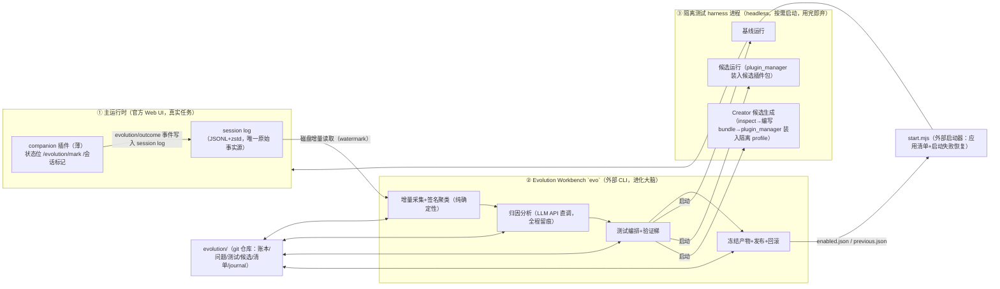

# Continually Self-Evolving Harness：设计方案（2026-09-19）

> 版本核查补注（2026-09-19 更新）：本文为独立提案，并非已确认实施方案；实际实施以[1.3 技术设计](./2026-08-17-continually-self-evolving-harness-design.md)和决策记录为准。本文已按上游 `ddefc45`（`0.1.6-alpha.2`）同步修订，修订点见附录 A；上游变化事实与[上游兼容性核查](../research/2026-09-19-harness-upstream-compatibility.md)互为印证。

> 性质：独立设计方案。研究输入为 DeepSeek Harness 源码、8 篇 Harness Evolution 论文、3 个参考实现源码，以及本仓库已有的一组设计文档（`2026-08-17/08-18/08-20` 系列，作为参考资料而非基底）。与既有文档的关系见第 11 节。
>
> 技术基线：DeepSeek Harness `ddefc45`（`0.1.6-alpha.2`，2026-09-17；本地 `vendor/deepseek-harness` 待重钉基线并重建，见 §9.2）、Node.js 24、pnpm、`deepseek-official` / `deepseek-v4-flash`、官方 Web UI（`dsh web`）与 headless 模式（`dsh headless`，带机器可读 JSON 流）。本文初稿基于 `47f9438`（0.1.0-rc.5），2026-09-19 按上游更新同步修订；修订集中在 §1.1、§3、§5.5–5.6、§7、§9.2 与附录 A。

---

## 0. 摘要

在 DeepSeek Harness 之上补一个**进化控制面（Evolution Control Plane）**，把 harness 已有的"事件溯源 trajectory、运行时内省、Plugin Manager/插件-profile 持久化、快照回放测试设施"串成闭环：

```
真实任务会话日志 ──磁盘增量──▶ 经验账本（确定性失败签名聚类）
    │                                   │
用户结果标记 / message-feedback          ▼
                              问题卡片（LLM 归因 + 归因门 + 可弃权）
                                       │  人工确认
                                       ▼
                          冻结测试包（事故测试 + 隐藏 holdout + 回归池）
                                       │
                                       ▼
                  候选生成（隔离进程内 Creator 流程：inspect→编写标准插件包→plugin_manager 安装，单一边面合同，≤3 版本）
                                       │
                                       ▼
        验证梯 L0 结构 → L1 回放 → L2 事故/holdout 配对实测 → L3 回归池 → L4 人工审查
                                       │  通过
                                       ▼
              冻结产物 → 干净实例复验 → 批准 → 安装进正式 profile + 启用清单更新（只影响新会话）
                                       │
              观察期 ◀── 技术故障自动回滚 / 行为退化人工裁决 ──┘
```

三个要点与既有方案的主要差异：

1. **进化大脑外置**：分析、挖掘、测试编排、验证、发布管理全部放在主运行时**之外**的 Evolution Workbench CLI（`evo`），主进程内只留一个 <300 行的 companion 插件（状态显示 + 结果标记）。被进化的运行时不承载修改者本身。
2. **两个显式合同**：可编辑面（editable surface）注册表约束候选形态；确定性失败签名（closed vocabulary）约束经验挖掘。两者都是机器可校验的，不是提示词约定。
3. **验证梯增加廉价的回放层**：利用 harness 自带的 snapshot/llm-mock 设施先挡结构回归，真实模型配对实测只留给行为门，把单个候选的验证成本压下来。

第一阶段证明方式是**双轨**：种子纵向 drill（≥3 个独立会话自然复现同一 harness 可修弱点，系统不被告知问题所在，必须自主发现→归因→修复→验证→保留）作为工程性闭环证明；真实使用轨并行积累，其首个确认实例作为研究性结论。

---

## 1. 研究输入与设计依据

### 1.1 DeepSeek Harness 已经提供什么（源码核实）

| 能力 | 机制（以 `ddefc45` 为准） | 位置 |
|---|---|---|
| 完整 trajectory | append-only `SessionEvent`（turn/step、tool call/result 含 `error {name,code,reason}`、request header；assistant 流内嵌于 `assistant/message`，失败尝试落 `assistant/attempt`，系统提示为 durable `system/message`），post-commit `session/event` 广播且观察者失败被隔离 | `packages/core/session` |
| 跨会话读取 | handle 式 `SessionPersistence`：`stat/list`（opaque revision）+ `open(id,'read')` → `handle.read(offset,length)`；**日志格式 v3**，官方提供 v0→v1→v2→v3 相邻迁移链（只读打开自动迁移）；`SessionQuery`（过滤/全文检索/lineage，sqlite FTS 索引） | `packages/session/*` |
| 用户显式反馈 | `/feedback`（durable `feedback/record` 事件，带 category）；消息级评分也移入 session log 成为 durable 事件 `feedback/message-put|delete`（原 sidecar 移除） | `packages/feedback/*` |
| 运行时内省 | `cordis_inspect_list/query`：实时 services、events、tools、API catalog | `packages/extensions/tool-cordis` |
| 模型侧扩展入口 | 旧 `cordis_define/run/stop/undefine` 模型工具**已移除**；新 Creator 流程 = 先 `cordis_inspect_*` 读真实契约 → 工作区编写标准插件 bundle → `plugin_manager`（`install_bundle/set_plugin/…`）装入 profile，HMR 生效；安装 Host 代码运行于宿主进程、**不受沙箱约束**；Plugin Manager 安装事务化（失败回滚 manifest），但**激活失败不自动卸载**，且修改是 profile 全局而非会话级 | `packages/boot/plugin-manager`、`packages/preset/agent-presets/presets/cordis` |
| 持久组成层 | bundle → profile `cordis.patch.yml` → home patch → `--patch` overlay；`dsh plugin --profile X add` 装本地插件；patch/配置 HMR；启动时**非必需插件加载失败仅警告**（required 失败才退出） | `apps/cli/src/profile-boot.ts`、`packages/boot/app-boot` |
| 新会话级能力切换 | Agent preset generation：composition 变化只影响后续 session；blank 会话切换 preset 落 durable `agent-preset/selected` | `packages/preset/agent-presets` |
| 热发现技能 | `<project>/.dsh/skills` Chokidar 监听，落盘即生效 | `packages/skill/*` |
| 拦截面 | `agent/pre-step`、`agent/request`、`agent/turn-stopping`、`tools/pre|execute|post-execute` waterfall（契约不变） | `packages/core/*` |
| 验证设施 | 顶层 `snapshots/` 语料库（replay-diff 归一化事件流 + 声明式 `snapshot.yml`）、`llm-mock-server`、`llm-replay`（含 override sidecar）、`agents.create({seed})`（替代已移除的 `sessions.fork`）、headless 模式 + 机器可读 JSON 流、Python/TS SDK | `packages/test-support/*`、`snapshots/` |
| 派生状态聚合 | `ctx.sessionProjections`：注册的纯函数单元增量 fold 已提交事件为 typed state（可选用于进程内实时聚合） | `packages/session/session-projection` |
| 廉价 outcome 特征 | durable `workspace/changes` 事件（每个 top-level turn 改了哪些文件） | `packages/deliverables/workspace-changes` |
| 空闲调度 | `ctx.jobs`、`agent.runMaintenance()`、`packages/schedule`、`ctx.webhookRuntime`（外部触发新 session） | — |

**结论**：缺的不是"让模型写一个插件"的能力，而是跨会话的控制流程——经验账本与模式挖掘、组件归因、候选与证据的可追溯绑定、持久候选仓库、行为评估、分阶段发布与回滚。这九件事全部由本方案补齐。

### 1.2 八篇论文的共识与最强证据

共识架构（六阶段）：**采集 → 组织 → 模式发现/归因 → 定位到组件的修改 → 分层验证 → git 级持久化/回滚**。

实证支持最强的六条，直接决定本方案的骨架：

1. **原始轨迹访问 ≫ 分数/摘要**（Meta-Harness ablation：median 50.0 vs 34.6/34.9）→ 经验层必须保留指向原始事件的引用与分层下钻，不只存结论。
2. **结构组件承载增益，prompt-only 不够**（AHE 组件 ablation：仅 system prompt 67.4% 倒退；MOSS 的源码级论证）→ 候选必须是可执行的 Cordis 能力（tool/policy/listener），提示词类只作低风险补充面。
3. **回归门有效**（Self-Harness 9/9 组合双 split 全升零回归；AHE manifest 证伪回滚）→ 接受规则采用"双非回归 + 至少一升"，且通过案例进回归池。
4. **过拟合真实可测**（AAH 无界进化先升后降、`news_from_future.md` 案例；HarnessCompass 无门控 memory 是"答案本"）→ holdout 对生成方不可见 + 过拟合静态扫描（Generalization Gate）。
5. **自我归因对"会坏什么"接近失明**（AHE：regression 预测 precision 11.8%，仅 2× 随机）→ 回归防护不能依赖候选自声明风险，必须实测回归池；晋升必须人工批准（第一阶段）。
6. **无标签场景 judge 不可靠**（TTHE：selection regret 14pp）→ 接受判定全部用确定性 checker 脚本，不引入 LLM judge 做最终门。

其他被吸收的教训：MOSS 的"失败证据批触发定向进化 + 隔离重放 + last-known-good 回滚"部署语义；Adaptive Auto-Harness 的 temporal-reveal 与"隔离优于合并"（branch 稀释 −57pp）；Continual Harness 的能力地板警告（弱模型上进化可能负收益，因此锁定单一强模型做基线）与"成功模式也值得挖掘"；Meta-Harness 的"候选先过冒烟测试再上贵评估"。

### 1.3 参考实现的工程结论

- **Self-Harness**：virtual-hook 白名单（每次恰好改一个 hook）、候选物化到独立目录、parent-relative 接受门（"no split drops and ≥1 improves"）——这套窄合同是防止"整篇重写"的关键，几乎原样移植。
- **AdaptiveHarness**：workspace 目录合约 + `protect()` 层快照 + Git rollback-as-new-commit。反面教训：`GatingStrategy`/`TrialRunner` 存在但**未接入默认路径**——验证门必须是闭环的必经之路，不能是"有但没接"的模块。
- **prime-agent**：小 entry + 结构化 CRUD edits + before/after 快照 + tmp+rename 原子写 + rollback 即逆事件。其"可审查可撤销的在线记忆更新"语义移植到我们的 journal 与 manifest。

---

## 2. 目标与非目标

### 2.1 研究问题

> 固定的 DeepSeek-V4-Flash，能否从自己长期执行真实任务的记录中，自主发现一个事先无人指出的 Harness 弱点，并把它转化为经过配对验证、可持久保留、可回滚的 Cordis 能力？

（与既有产品设计第 2 节一致——这个问题定义是对的，保留。）

### 2.2 第一阶段必须证明的链条

一条完全可审计的证据链，每一环有 artifact 落盘：

1. 弱点由 ≥3 个独立会话的证据自动聚合发现（系统不知道答案）；
2. 归因落到一个明确的 Cordis 可编辑面，且经过"是否真是 harness 问题"的归因门（允许弃权）；
3. 事故测试在候选生成**之前**冻结，基线稳定失败；
4. 候选通过隐藏 holdout（机制相同、内容不同、生成方不可见）；
5. 回归池（基础任务 + 历史通过案例）无退化；
6. 候选以最终形态（标准插件包）通过全部验证并经干净实例复验，人工批准后进入正式 profile；
7. 只影响新会话；跨重启存在；注入技术故障能自动回滚到上一清单。

### 2.3 非目标（第一阶段明确不做）

不重训模型、不做 RL；不改 DeepSeek Harness 核心源码、不维护分叉；不做多候选并行竞争与自动合并（每问题 ≤3 个**串行**版本）；不做 harness tree / 任务路由（Adaptive 的分支机制留待真实出现任务异质冲突后）；不做自动晋升（人工批准是硬门）；不做向量库/知识图谱/通用评分器/LLM judge；不宣称进程隔离是恶意代码安全边界；不做独立管理页面（companion 插件的 Web 状态位 + CLI 报告足够）。

---

## 3. 总体架构：三个角色 + 一个 git 仓库

### 3.1 组件图



### 3.2 主运行时内：companion 插件（保留并扩展现有 evolution-probe）

主进程内**只有**这一件自进化代码，职责四项，全部轻量：

1. **常驻状态位**：Web 界面 `conversation.composer.dock` 插槽显示状态（"记录中 / 发现问题待确认 / 新版本观察中 / 已暂停"）。milestone-0 已验证此路径。
2. **结果标记**：注册 `evolution_mark` 工具 + `/mark` 命令，把 `{mark: success|partial|fail, note}` 作为自定义 durable 会话事件（`evolution/outcome`，经 `SessionEventMap` 声明合并，**必须带 `ignorable: true`**——否则第一方 reader 会拒读整个日志）写入 session log——**标记本身进入原始事实源**，采集端零额外通道；新版消息评分本身已是 durable 事件（`feedback/message-put`），作为补充信号一并采集。
3. **会话属性标记**：会话创建时写入 `drill: true|false`（人工练习与真实任务从入口分离，统计可排除）。
4. 无其他逻辑。不分析、不生成、不测试、不写清单。

**为什么把控制面外置**（与既有方案的核心分歧，理由）：

- **自指风险**：进化机制运行在被进化的运行时里，候选实验、LLM 编排任何一环出错都可能波及真实会话；外置使"进化侧崩溃不影响主任务"从"要处理的故障"变成"结构上不可能"。
- **可测试性**：workbench 是普通 Node CLI + 文件，单测/集成测不需要 Cordis 生命周期；这也让闭环的每一环可以在没有 Web UI 长开的情况下离线开发与回归。
- **能力不受损**：外置进程要的三样东西 harness 都以文件或子进程形式提供——session log 在磁盘、隔离运行有 headless 模式、候选生成有新 Creator 流程（inspect + plugin_manager，在隔离进程内跑）。唯一必须进程内的需求（状态位、标记）恰是 companion 插件承担的部分。
- 既有方案也已有外部启动器与独立测试进程，外置只是把"分析/编排"也挪出去，主进程内的控制插件从七项职责缩到四项轻职责。

### 3.3 Evolution Workbench（`evo`，新的核心交付物）

一个 Node CLI（pnpm workspace 内新包 `packages/evo`），子命令即闭环阶段：

| 命令 | 职责 |
|---|---|
| `evo ingest` | 扫描 `~/.dsh/sessions/`，经官方 `SessionPersistence.open('read')` + `handle.read(offset,length)` 增量读取（自动走 v0→v3 迁移链），以 opaque revision 为 watermark；只折叠 flush 之后的事件 |
| `evo mine` | 确定性签名聚类，产出/更新 cluster cards |
| `evo analyze` | 对选定 cluster 跑 LLM 归因，产出问题卡片（含归因门裁决） |
| `evo test-author <problem>` | 隔离上下文生成并冻结事故测试 + holdout 测试 |
| `evo candidate <problem>` | 启动隔离 Creator 会话生成候选（≤3 串行版本）：inspect → 编写标准插件 bundle → `plugin_manager` 只装入隔离测试 profile |
| `evo validate <candidate>` | 跑验证梯 L0–L3，产出配对报告 |
| `evo promote <candidate>` | 冻结产物 → 干净实例复验 → 人工批准后由 workbench（而非模型侧）安装进正式 profile，原子更新启用清单 |
| `evo rollback` / `evo status` / `evo report` | 清单回滚 / 状态查看 / 人类可读报告 |

LLM 角色（Analyst / Test Author / Fixer）用 `deepseek-v4-flash` 直调 API，prompt/response 全量落盘到 journal（审计免费获得）。所有命令串行互斥（文件锁），第一阶段不做并发。

### 3.4 隔离测试进程

`evo` 按需启动独立 harness 进程，三用途共用一套环境约束：

- **环境**：固定 harness 构建 + **独立 `DSH_HOME` / 测试 profile / 工作区**。新版 plugin_manager 的安装是 profile 全局操作、安装后的 Host 代码在宿主进程内不受沙箱约束——隔离边界必须靠独立 home + 环境变量允许清单（不继承生产密钥）+ 默认无网 + 临时工作区（fixture 复制/git clone）实现。
- **基线/候选配对运行**：`dsh headless` 机器可读 JSON 流 + `--patch` overlay（基线不带候选，候选运行装入候选插件包），同一 fixture、同一模型配置，各自 ≥2 次重复。
- **候选生成**：同一隔离环境内开 Creator 会话，模型先 `cordis_inspect_list/query` 读真实接口契约，在工作区编写标准插件 bundle（package.json + src + patch 层），再经 `plugin_manager` 装入隔离 profile、HMR 生效后运行、读诊断、失败则卸载-修改-重装迭代；`evo` 侧录制全过程。候选**从一出生就是标准插件包**，不存在"动态定义→物化"转换；被测形态与最终晋升形态完全相同。候选不带 UI half（避开浏览器审批回路），第一阶段候选不允许有界面贡献。
- 诚实声明：隔离用于**防误伤**，不是恶意代码安全边界；候选一律按受监督实验代码处理。

### 3.5 Evolution Home（`evolution/`，git 单一事实源）

```text
evolution/
  ledger/observations.jsonl        # 派生经验（引用原始 session id+seq，可重建）
  ledger/clusters.json             # 当前聚类状态（可从 observations 重建）
  problems/P-0001/
    problem.json                   # 问题卡片（schema 见 §4）
    evidence/                      # 脱敏证据窗口（markdown，人可读）
    tests/T-0001-incident/         # 冻结测试包（incident + holdout 分开目录）
    candidates/C-0001/v1..v3/      # 候选版本（源码、生成记录、权限声明、验证报告）
    promoted/                      # 正式晋升插件包的最终产物（内容冻结，记录 contentHash）
  regressions/                     # 回归池：基础任务 + 历史通过案例（通过案例即回归测试）
  state/enabled.json               # 当前启用清单（插件路径+内容哈希）
  state/previous.json              # 上一份清单（回滚目标）
  journal.jsonl                    # 追加式审计日志：每个动作的 actor/action/evidence/cost/decision
  reports/                         # 人工审查用的 markdown 报告
```

整个目录纳入项目 git：**promotion = commit + tag；rollback = 清单指针回拨的新 commit**（被拒/被回滚的产物永不删除，AdaptiveHarness 的 rollback-as-new-commit 语义）。既有方案提出"复用 harness storage-domain 保存六类记录"——我改为纯文件 + git：所有参考实现都收敛于此，且进化状态不应耦合在被进化运行时的存储插件上；harness 自己的 session log 仍是原始事实的唯一来源（这点与既有方案一致）。

### 3.6 外部启动器（沿用已有设计）

`scripts/start.mjs`：读 `enabled.json` → 组装 profile/patch → 启动官方 Web UI → 健康检查；失败则恢复 `previous.json` 重试一次，再失败显式退出。健康检查**不能止于"端口可用/进程未退出"**：新版启动对非必需插件加载失败只发警告，页面能打开不代表受管理正式插件激活成功——必须核对清单内插件的实际激活状态（`--dump-config` 或 plugin_manager 枚举）。控制面不在主进程内，所以启动期恢复天然不依赖任何插件存活。milestone-0 任务六继续有效（验收标准按本节更新）。

---

## 4. 数据模型（第一阶段 schema）

### 4.1 Observation（每会话一条，`ledger/observations.jsonl`）

```jsonc
{
  "schema": 1,
  "session": {
    "id": "session-41e35adb-…", "createdAt": 1787243355785,
    "preset": "ptc", "model": "deepseek-v4-flash",           // 记实际 preset ID（旧 "code" 已映射为 "ptc"）
    "harnessCommit": "ddefc45…", "formatVersion": 3,         // v2→v3 迁移会改事件序号：证据坐标必须含格式/代际
    "manifestHash": "sha256:…",                              // 当时启用清单
    "drill": false
  },
  "outcome": { "mark": "fail", "note": "改完没跑测试就说完了", "source": "evolution/outcome" }, // source ∈ evolution/outcome | feedback/record | feedback/message-put
  "turns": [{
    "turnSeq": 3, "endReason": "completed", "steps": 7,
    "toolCalls": 21,
    "toolErrors": [{ "name": "bash", "code": "EXIT_NONZERO", "count": 4 }],
    "identicalRetryMax": 3,                    // 同参数重复调用同一工具的最大次数
    "verificationRan": false,                  // 终答前是否执行过测试/构建类命令（启发式词表）
    "refs": { "startSeq": 120, "endSeq": 341 } // 指回原始 session log（按 session.formatVersion 解释）
  }],
  "friction": { "totalTurns": 6, "totalTokens": 91234, "distinctFailedTools": 2, "filesTouched": 3 }, // filesTouched 取自 workspace/changes 事件
  "signature": { /* §4.2，会话级聚合 */ },
  "capturedAt": "…", "watermark": { "revision": 17 }
}
```

原始对话内容**不复制**；分析需要细节时按 `refs` 回读 session log 并脱敏摘录进 `evidence/`。

### 4.2 失败签名（closed vocabulary，机器聚类键）

```text
signature = ( outcome_class, tool_error_family, behavior_mechanism )

outcome_class     ∈ { fail_marked, partial_marked, turn_error, max_tokens, aborted, unmarked, success }
tool_error_family ∈ { none, exit_nonzero, timeout, not_found, permission, quota, schema_mismatch, other }   // 由 error.name/code 归一
behavior_mechanism∈ { repeat-failed-retry, done-without-verification, excessive-exploration, late-recovery, none }
```

`behavior_mechanism` 由确定性规则从 turns 事实判定（如 `done-without-verification` := 存在 mark≠success 或终答宣称完成，且最后 N 个 turn 均 `verificationRan=false`）。聚合同键、按 `独立会话数 × 严重度` 排序；**同一会话内多次失败只计一个支持案例**。成功会话作为 counter-evidence 附加到 cluster。

### 4.3 问题卡片（`problems/P-####/problem.json`）

```jsonc
{
  "id": "P-0001", "signature": "…", "status": "mined → confirmed → testing → resolved | unresolvable | rejected | observing",
  "support": [{ "sessionId": "…", "refs": [120,341], "summary": "…" }, /* ≥3 个独立会话 */],
  "counterExamples": [{ "sessionId": "…", "note": "同类任务成功" }],
  "attribution": {
    "verdict": "harness-attributable",        // | model-limit | environment | insufficient-evidence
    "surface": "tool-policy",                 // §4.4 可编辑面之一；弃权时为 null
    "harnessHypothesis": "结束前缺少验证检查，且无 turn 级拦截",
    "modelHypothesis": "也可能是模型倾向乐观汇报", "confidence": 0.6,
    "reasoning": "…", "analystRun": "journal#4821"
  },
  "humanReview": { "confirmedBy": "yyh", "edits": [/* 人工修正留痕 */] },
  "testability": "replay-fixture"             // | small-repo | git-commit | untestable
}
```

归因门规则：`model-limit / environment / insufficient-evidence` 一律不开候选（Self-Harness addressability + MOSS 的 MODEL/ARCHITECTURE LIMIT 弃权裁决）。人工确认只允许修正事实与脱敏，不允许提供根因或解法——否则该问题降级为"人工辅助"，不计入自主发现成果（沿用既有决策 D-020，规则正确）。

### 4.4 可编辑面注册表（候选合同，第一阶段白名单）

| surface | Cordis 机制 | 风险级 | 说明 |
|---|---|---|---|
| `skill` | `.dsh/skills/<n>/SKILL.md`（热发现） | 低 | "hello world" 候选类，部署最简单 |
| `prompt-section` | 插件内 `ctx.systemPrompt` 注入 | 低 | 单独使用证据不足，仅作组合的一部分 |
| `tool` | 插件内 `ctx.tools.register`（defineTool） | 中 | 新工具 |
| `tool-policy` | `tools/pre-execute` / `post-execute` listener | 中 | 包装/拦截既有工具 |
| `turn-check` | `agent/turn-stopping` / turn 结束检查 + `agent.inject` | 中 | 如"未验证不得宣称完成" |
| `slash-command` | `ctx.commands` | 低 | 操作辅助 |

每个候选必须声明：`surface`（恰好一个主面）、`mechanism`（一句话）、`permissions`（读哪些状态/听哪些事件/是否 fs·net·exec）、`problemId`、`parentManifestHash`。**禁区**（申报即拒绝）：approval/sandbox/persistence/llm-adapter/session 核心代码、模型与评估配置、其他插件的既有 row、任何试图修改测试或评判逻辑的内容（AHE 反博弈：verifier/model config 只读）。

"完整能力"仍允许——候选插件可以组合 tool + prompt-section 服务同一问题——但必须声明主面并接受对应验证配方（比既有方案"只限问题范围"多一层机器可校验的归因约束）。

### 4.5 测试包（`problems/P-####/tests/`）

```text
T-0001-incident/
  test.json     { id, kind: "incident"|"holdout", frozenAt, contentHash, passConditions[] }
  fixture/      工作区模板（小型 git 仓库 / 文件集 / 回放脚本，三者选一，按成本升序）
  check/checker.mjs   确定性判定脚本
```

`checker.mjs` 输入 = 会话结束后的工作区路径 + 该次运行的完整事件流，输出 = `PASS|FAIL + reasons`。因为能看到事件流，它可以确定性断言 harness 级行为（例如："终答前存在匹配 `test|pytest|npm test|go test` 的命令执行" 且 "终答含完成宣称" ⇒ FAIL）。**最终接受判定只用 checker，不用 LLM judge**（TTHE 教训）。holdout 在独立上下文生成、内容哈希冻结、候选生成方不可见；incident 对生成方可见。

### 4.6 启用清单与 journal

`enabled.json`：`{ plugins: [{ id, path, contentHash }], version, promotedAt, problemId }`；`previous.json` 为上一份。journal 每行：`{ t, actor: miner|analyst|test-author|fixer|validator|operator, action, subject, evidence: [refs], decision, cost: { tokens, approxUsd } }`——每步进化的证据链与成本都记账。

---

## 5. 闭环六阶段规格

### 5.1 采集（被动、增量、零打扰）

只做磁盘增量：`evo ingest` 走官方 `SessionPersistence` handle API（`stat` 取 revision → `open(id,'read')` → `read(offset,length)`），新事件折叠进 observation；**只折叠 flush 之后的事件**（flush 是持久性屏障，事件已到达 ≠ 已跨崩溃保存）。`evolution/outcome`、`feedback/record`、`feedback/message-put` 一并归并。新旧格式会话并存时各记 `formatVersion`，旧格式经官方迁移链读取，旧证据序号不得当作新版本序号续读。采集失败只影响本次 ingest，主任务无感知（外置的结构性收益）。触发：`evo ingest` 手动 / 定时脚本 / `evo watch` 可选守护。**分析永远有新账本数据才跑，没数据不跑。**

### 5.2 挖掘（纯确定性）

`evo mine` 重算签名聚类，输出 cluster card（支持数、counter-evidence、严重度、时间趋势）。不调模型。趋势数据同时暴露**成功但高成本**（多轮重试后成功）的会话簇——第二阶段作为成功模式挖掘的输入（Continual Harness 教训），第一阶段只记录不处理。

### 5.3 归因（唯一引入 LLM 的分析步骤）

`evo analyze <cluster>`：给 Analyst（Flash 直调）的证据 = cluster card + 每个支持会话的脱敏证据窗口（按 refs 回读原始 log，密钥/路径/环境变量脱除）+ 对应成功案例。要求产出 §4.3 结构（含 harness/model/environment 三方假设与置信度），并显式允许弃权。第一阶段做单遍 grounded 归因；Compass 式 blind/hindsight 双报告作为后续增强位（接口预留 `analystRun` 可多run）。产出问题卡片 → **人工确认**（确认事实，不给解法）。

### 5.4 测试先行（在候选之前，且不可逆序）

`evo test-author <problem>`：Test Author 在独立上下文（看不到任何候选、看不到 holdout 之外的测试）生成 incident + holdout 两个测试包与通过条件，写盘并记 contentHash **冻结**。随后必须先验证：**基线在 incident 上稳定失败**（跑 ≥2 次）；若基线通过，说明测试无效或问题归因错，退回归因。人工可修正测试（新版本 + diff 留痕，修正后重验基线失败）。三种 fixture 形态按成本选首个可行的：固定模型回放 / 小型独立代码仓库 / 授权 git 提交快照；都不可行 ⇒ 问题标记 `untestable`，不开候选。

### 5.5 候选生成（隔离进程内 Creator 流程，≤3 串行版本）

`evo candidate <problem>`：启动隔离 harness 进程开 Creator 会话（新版对"创造模式"的替代），输入 = 问题卡片 + 脱敏证据 + **公开的 incident 测试** + 当前启用清单 + surface 注册表与权限约束。要求流程：先 `cordis_inspect_list/query` 读真实接口 → 工作区编写标准插件 bundle（package.json + src + patch 层）→ `plugin_manager` **只装入隔离测试 profile** → HMR 生效运行 → 读诊断 → 失败则卸载-修改-重装，同版本内迭代（上限：3 个串行候选版本，每版本内部迭代 ≤5 次）。候选**从一出生就是标准插件包**，没有"动态定义→物化"转换，被测形态即最终晋升形态。模型**看不到** holdout 与回归池内容（目录级隔离），且**结构上不可能对正式 profile 调用 plugin_manager**（隔离 DSH_HOME）。允许 evidence-backed `decline`（"无法以允许的 surface 解决"→ 问题转 `unresolvable`）。

### 5.6 验证与晋升

见第 6 节验证梯。通过 L0–L3 后：**冻结候选产物**（记录 contentHash；任何改动即重回验证）→ **干净实例复验**：在全新测试实例以冻结产物原样重装并复跑 L0–L2 核心门（防止"在脏环境里通过"）→ 生成候选审查报告（`evo report`：问题、能力、权限、diff、全部测试结果、回滚目标）→ **人工批准** → 由 workbench（promoter 角色，非生成模型）把冻结产物安装进正式 profile（`dsh plugin add` 或 plugin_manager CLI），原子更新 `enabled.json`（previous ← 旧 enabled）→ git commit + tag → 新会话生效，进入观察期。

---

## 6. 验证梯与接受规则

### 6.1 四层 + 人工门

| 层 | 内容 | 成本 | 用途 |
|---|---|---|---|
| **L0 结构/生命周期** | 语法与 schema 校验、surface 合同校验、权限声明核对；隔离进程内 load → stop → 再 load → 清理（监听/工具/计时器零残留，借 Cordis fiber 可逆性） | 极低（无模型调用） | 挡坏候选（Meta-Harness 冒烟哲学） |
| **L1 回放/快照**（新增层） | 对确定性影响面（tool-policy/turn-check 的行为、技能注入）用 llm-mock-server / snapshot replay 跑固定脚本，diff 归一化事件流 | 低（无真实模型） | 结构回归早发现 |
| **L2 事故/holdout 实测** | 真实模型、隔离进程、一次性工作区：基线与候选**配对**各 ≥2 次（headless JSON 流采集结果） | 高（真实推理） | 行为改善证明 |
| **L3 回归池** | 基础任务（5–10 个）+ 历史通过案例，基线可复用缓存（绑定 manifestHash/模型/配置，基线变则失效） | 高 | 无退化证明 |
| **L4 人工审查** | 报告 + 清单：过拟合扫描结果、权限必要性、单一问题范围、未触碰禁区、测试充分性 | 人时 | 最终门 |

### 6.2 接受规则（确定性，无总分）

```text
accept(C) ⇔
  L0 ∧ L1 全绿
  ∧ incident:  baseline_fail(2/2) ∧ candidate_pass(2/2)
  ∧ holdout:   candidate_pass(2/2)            // holdout 基线若也过 ⇒ 证据弱，降级人工裁决
  ∧ regressions: ∀t∈pool: score(C,t) ≥ score(baseline,t)   // 允许持平，任何下降即拒
  ∧ 静态过拟合扫描干净 ∧ 人工批准
```

稳定性规则：任一测试两次结果矛盾 → 加测一次；仍矛盾 ⇒ 判"证据不足"拒绝该版本，**禁止挑最好结果**。版本失败 ⇒ 修复诊断反馈给下一版本；3 版本全败 ⇒ 问题转 `unresolvable`。每层预算记账（journal.cost），单候选 live 运行上限默认 4×2 + 10 池 ≈ 18 次完整任务。

### 6.3 过拟合静态扫描（Generalization Gate 的机器化部分）

对候选源码与 prompt 文本扫描：incident fixture 的仓库名/文件路径/私有符号/测试函数名/仅在该任务出现的 token 出现即标记，人工审查必须逐条解释或拒批。硬性禁止：任何"if 任务/路径 == X"式条件分支。

---

## 7. 版本管理、发布与回滚

1. **生效边界**：批准后的插件经两条路径进入实环境：(a) preset/技能目录（会话粒度，天然只影响新会话）；(b) profile 全局插件安装——后者影响该 profile 全部会话，**不得把"HMR 已应用"当作"只影响新会话"**：全局插件一律经外部启动器以新运行实例应用，不在运行中的主进程热切换。会话头记录 manifestHash，observation 可追溯每个会话用的能力集；进行中会话保持原组成（上游明确警告 mid-session 换组成会造成 tool-call 记录不一致）。
2. **观察期**：promoted 插件标记 `observing`；后续 observation 持续进账本。原始签名复发 ⇒ 关联回问题卡片（不自动删历史结论）；"稳定"由操作者判定。
3. **三层回滚**：
   - 运行中技术故障（插件激活失败/崩溃循环/配置解析失败）⇒ `evo rollback` 卸载或停用肇因插件、清单切回 `previous.json`。注意 Plugin Manager 语义：安装失败会事务性回滚 manifest，但**激活失败不自动卸载**——回滚是 workbench 的职责，这正是独立维护 `enabled.json`/`previous.json` 的理由；
   - 启动期失败 ⇒ 外部启动器恢复 `previous.json` 重试一次（健康检查须确认受管理插件实际激活，而非仅页面可达；不依赖任何插件存活）；
   - 行为退化（结果标记变差/步骤增多）⇒ 记录 + 提醒 + **人工裁决**（第一阶段不做行为性自动回滚，小样本噪声大——沿用既有决策 D-030，判断正确）。
4. 所有回滚都是"清单指针回拨 + 新 commit"，坏版本与故障记录永留。

---

## 8. 安全与治理

- **权限声明**（§4.4）+ 禁区清单 + 申报即拒；正式运行中的写文件/联网/外部命令必须走 harness 现有工具与批准流程，插件不得绕过。
- **测试环境**：环境变量允许清单、无生产密钥、临时目录、默认无网。诚实边界声明：这是防误伤隔离，不是恶意代码防御；容器/Landlock 级隔离留待第二阶段（macOS 开发机上 Landlock 不可用，标注为部署目标能力）。
- **反博弈**：评估器、模型配置、测试包内容Hash 对所有 LLM 角色只读；候选不得修改测试/评判（L4 检查 + 禁区扫描）。
- **隐私**：分析只送脱敏证据窗口；派生材料默认本地保留；删除指定任务派生材料时保留最小删除记录。新版**默认向 DeepSeek 上传 session log**（可退出的 opt-out）——本项目研究立场是本地保留，重钉基线后按官方说明评估是否关闭上传并记入决策日志。
- **人在环**：确认问题、修正测试、批准晋升、裁决退化——四个固定人工门，其余全自动。第二阶段起按风险分级放开低风险面（skill/prompt-section 类）的批准压力，高_risk面（权限/安全/核心流程）永不自动。

---

## 9. 实验计划与里程碑

### 9.1 双轨证明

- **Drill 轨（工程证明，第一优先）**：构造 ≥3 个内容不同的小型代码任务（不同仓库、不同改法），**自然**复现同一 harness 可修弱点（首选家族：`done-without-verification`——它可从事件流确定性检测、可用 turn-check/tool-policy 修、测试 checker 好写）。关键纪律：只给系统原始轨迹与标记，**不告诉它问题是什么、在哪、怎么修**——发现与归因必须是系统自己完成的。Drill 不计入"真实发现"研究成果，但闭环的每一环（挖掘→归因→冻结测试→基线失败→候选→holdout→回归池→产物冻结复验→批准→观察→回滚演练）都在 drill 上演示。
- **Real 轨（研究证明）**：日常 PTC 真实任务持续打标记；研究协议沿用既有设计的 30 任务复盘框架（问题须 ≥3 独立真实任务支持、人工只确认事实、成功十条件沿用既有产品设计 §2——那套判据是完备的，保留）。Drill 通过而 real 轨 30 任务内无合格问题 ⇒ 结果如实记为"工程闭环成立、真实轨待续"，不降低标准也不判死。

### 9.2 里程碑（吸收并续接已完成工作）

| 里程碑 | 内容 | 验收 | 现状 |
|---|---|---|---|
| **M0 接口探针（新基线重钉后重做）** | 原五项按新版重组：基线启动 / 插件+会话记录 / 常驻状态 / **隔离 Creator 候选（inspect→编写 bundle→plugin_manager 装入隔离 profile）** / **产物冻结+干净实例复验+启动恢复（健康检查含受管理插件激活状态）** | 新基线上五项实际运行证据 | 现有 3/5 证据属**旧基线（47f9438），不能冒充新版验收**；evolution-probe 客户端代码依赖已删除的 `dsh-client-runtime`，需按新客户端 API（SlotRegistry 移至 `dsh-client-ui-renderer/client`）迁移后复测 |
| **M1 账本+挖掘** | ingest（handle API）/mine + observation schema + drill 语料（≥3 会话）+ 真实会话并行积累 | 同一签名在 drill 语料聚成 1 个 cluster，支持数 ≥3，counter-evidence 正确附注 | 离线开发，不依赖 Web UI |
| **M2 归因+测试冻结** | analyze + 问题卡片 + test-author + 基线失败确认 | drill 弱点被系统自主命名并归因到正确 surface（操作者未提示）；incident 基线 2/2 失败 | |
| **M3 候选+验证梯** | candidate（Creator 流程）+ L0–L3 + 接受规则 + 过拟合扫描 | drill 候选通过全梯，或 3 版本失败留完整诊断 | |
| **M4 发布+回滚** | 产物冻结、干净实例复验、批准、装入正式 profile、清单、观察、三层回滚 | 标准插件跨重启存在；注入激活故障自动恢复；回滚后清单一致 | |
| **M5 闭环演示** | drill 全链 demo + 真实轨持续运行 | §2.2 七条链条全部有 artifact；真实轨按 9.1 协议积累 | |

### 9.3 度量

闭环健康度：每问题的发现→晋升转化率、候选版本失败原因分布、单候选全梯成本（token/时长/live 运行次数）、回归池增长率、晋升后观察期内原签名复发率。这些本身就是第二阶段扩大实验的自变量。

---

## 10. 主要风险与对策

| 风险 | 对策 |
|---|---|
| 只挖到无意义小错误 | 归因门 + 人工确认双筛；drill 家族从高价值行为弱点（验证缺失）切入；30 任务复盘可判"继续收集/调整方法/暂停" |
| 候选对测试写死 | holdout 不可见 + 静态过拟合扫描 + L4 清单 |
| 自我归因回归盲 | 回归池实测为硬门，不信候选自声明（AHE 数据） |
| 验证成本失控 | L0/L1 廉价层前置；基线结果按 manifestHash 缓存；每层预算记账并设上限 |
| Flash 能力地板（进化负收益） | 单一固定模型基线 + 配对比较（任何退化即拒）；若持续无有效候选，结论本身是研究产出 |
| 经验长尾：真实轨迟迟无 3 任务模式 | drill 轨先行证明机制；签名词表可扩展；成功模式挖掘为二阶段储备 |
| Plugin Manager 语义缺口（激活失败不自动卸载、profile 全局生效） | 候选只装隔离 profile；正式安装由 workbench 执行；独立维护 enabled/previous 清单；launcher 健康检查核对激活状态 |
| 进化状态损坏 | evolution/ 全量 git；observations/clusters 可从 session log 重建；journal 追加式 |
| 插件越积越多 | 第一阶段一问题一插件；真实出现维护负担后再整理（不做自动合并） |

---

## 11. 与既有设计文档的关系

既有文档（2026-08-17 设计/路线图、08-18 产品设计、08-20 milestone-0 计划、决策日志 D-001~D-041）作为参考资料完整读毕。本方案是独立设计，但对其结论逐条做过取舍，以下是明细。

### 11.1 直接保留（判断其正确且有文献/源码支撑）

不改核心源码、不维护分叉（D-034）；session log 为唯一原始事实源、派生数据只存引用；测试先于候选冻结（D-006）+ 隐藏相似测试（D-007）；动态候选仅作隔离实验、晋升必须是标准插件形态并复验（D-008/009/039——上游更新后此约束自然成立，候选从生成起就是标准插件包）；新版本只影响新会话（D-027）；技术故障自动回滚、行为退化人工裁决（D-030）；≤3 串行候选版本（D-023）；问题需 ≥3 独立任务支持、人工只确认事实不给解法（D-020 及同类）；隔离防误伤而非安全边界的诚实声明（D-040）；30 任务真实复盘协议；四期路线图的阶段纪律（未证明不开扩张）；milestone-0 的五项接口验证框架及已完成的三项证据（旧基线证据，方向仍成立）。

### 11.2 修改（本方案的主要分歧）

| # | 既有方案 | 本方案 | 理由 |
|---|---|---|---|
| 1 | 一个进程内控制插件承担采集/分析编排/测试管理/隔离启动/版本记录/发布恢复/界面七项职责 | 进化大脑外置为 `evo` workbench CLI；主进程只剩薄 companion 插件（状态位+结果标记+会话属性） | 自指风险、可测试性、故障隔离的结构性收益（§3.2）；harness 的 headless/磁盘日志/Creator 流程（inspect + plugin_manager）使外置无能力损失 |
| 2 | 验证五层全部为真实模型实测 | 增加 L1 回放/快照层（llm-mock/snapshot），真实模型只留给 L2/L3 | 单候选验证成本从 ~16+ 次完整任务降下来；harness 自带设施零开发量；论文一致把成本列为首要瓶颈 |
| 3 | 分析为"统计+LLM"两步，但签名/归因无机器可校验合同 | 确定性失败签名（closed vocabulary）+ 可编辑面注册表 + 归因门弃权裁决，三个显式合同 | Self-Harness 签名聚类、virtual-hook 白名单、addressability filter 的直接移植；使归因可复现可审计 |
| 4 | 六类记录复用 harness storage-domain | evolution/ 目录 + git 单一事实源，promotion=commit+tag，rollback=指针回拨新 commit | 所有参考实现的经验收敛；进化状态不耦合被进化运行时的存储；diff/审计免费 |
| 5 | 练习题仅作工程管道验证，第一阶段成功只认真实任务闭环 | 双轨制：drill 作为一等公民的机制证明，real 轨作研究确认，两者判据分开陈述 | 真实轨周期长且不确定；机制证明不应被真实轨的偶然性阻塞；诚实标注 drill 不冒充真实发现 |
| 6 | 状态与交互依赖较多界面贡献（问题卡片、候选审查卡片走界面插槽） | 界面只保留常驻状态位；问题确认/审查/批准走 CLI 报告 + markdown（`evo report`） | 第一阶段操作者就是项目负责人，CLI 足够；界面成本留到确有第二用户时 |

### 11.3 新增

L1 回放验证层；过拟合静态扫描；journal 全程成本记账与预算上限；结果标记写入 session log 的自定义 durable 事件（`evolution/outcome`）；成功模式（高成本成功簇）的记录位；`evo` 子命令级规格；drill 语料纪律（不告知问题所在）。

### 11.4 兼容与续接

已完成的 milestone-0 三项证据是**旧基线证据**：其结论（外部插件装载路径、`session/event` 记录、常驻状态可行性）作为方向仍成立，但重钉基线后须复测，且 evolution-probe 的客户端代码依赖已删除的 `dsh-client-runtime`，需按新客户端 API 迁移。evolution-probe 仍是 companion 插件雏形（补带 `ignorable: true` 的 `evolution/outcome` 事件与 `/mark`），`state/turns.jsonl` 迁移为 `evolution/ledger/observations.jsonl` 的种子；剩余两项探针按 §9.2 M0 的新定义执行。上游同步本身变更了既有决策 D-005（固定基线）：建议决策日志新增条目记录重钉（`ddefc45` / 0.1.6-alpha.2）及切换闸门（[上游兼容性核查](../research/2026-09-19-harness-upstream-compatibility.md) 第 3 节六项），不删除历史。

---

## 12. 开放问题（不阻塞开工，实施中决策）

1. `evolution/outcome` 自定义事件与 message-feedback 并存时，标记语义冲突（同会话先 fail 后 success）如何归一——倾向以最后一条为准并在 observation 里保留历史。
2. holdout 生成方与 incident 生成方是否需要不同 seed 会话（进一步降低风格泄漏）——M2 实测后定。
3. 验证梯 L2 的重复次数 2 是否足够区分 Flash 的随机波动——M3 用 drill 数据实测翻转率后校准。
4. `evo watch` 常驻守护是否引入（第一阶段可用定时脚本替代）。
5. 真实轨的标记负担：操作者忘标 `evolution_mark` 时的兜底信号（如 turn_error/max_tokens 自动类）占比多高——M1 后用真实数据评估。
6. 钉基线时机：`0.1.6` 尚为 alpha——立即重钉 `ddefc45` 开始迁移探针，还是等 0.1.6-rc/正式版再钉（代价是重钉后重建 + 探针复测要做两次）。倾向前者：探针迁移的发现越早越好，正式版发布后再钉一次 tag 即可。

---

## 附录 A：上游同步影响评估（2026-09-19）

上游 `47f9438`（0.1.0-rc.5，2026-08-13）→ `ddefc45`（0.1.6-alpha.2，2026-09-17）。本附录记录本次核查结论及其对本文的修订；事实细节与仓库方独立完成的[上游兼容性核查](../research/2026-09-19-harness-upstream-compatibility.md)一致，两份核查互为印证。

### A.1 破坏性变更（本文相应修订）

| # | 变更 | 对本设计的影响 | 修订位置 |
|---|---|---|---|
| 1 | 模型侧 `cordis_define/run/stop/undefine` 工具移除（tool-cordis 只剩 `cordis_inspect_list/query`）；新入口为 Creator 流程 + **Plugin Manager**（`plugin_manager` 工具 / `dsh plugin`） | 候选生成从"动态定义→物化"改为"直接编写标准插件 bundle→装入隔离 profile"；物化步骤消失，被测形态=最终形态，验证与晋升更干净 | §3.3、§3.4、§5.5、§5.6 |
| 2 | Session 磁盘格式 v0→v3；`SessionPersistence` 重写为 handle 式（`open('read')` + `handle.read(offset,length)`），SQLite 持久化后端删除 | `evo ingest` 读取路径改写；证据坐标须含 formatVersion（v2→v3 迁移改变事件序号）；官方迁移链使旧证据仍可读 | §3.3、§4.1、§5.1 |
| 3 | 自定义 durable 事件必须带 `ignorable: true`，否则第一方 reader 拒读整个日志 | companion 插件的 `evolution/outcome` 事件实现约束 | §3.2 |
| 4 | message-feedback 从 sidecar 移入 session log（`feedback/message-put|delete`） | 采集简化：反馈与标记同源（session JSONL），去掉 sidecar 读取 | §1.1、§5.1 |
| 5 | `ctx.sessions.fork` 移除（改 `agents.create({seed})`）；`dsh-client-runtime` 包删除（SlotRegistry 移至 `dsh-client-ui-renderer/client`）；启动时非必需插件失败仅警告 | 验证设施表述更新；evolution-probe 客户端代码需迁移后复测；launcher 健康检查必须核对插件激活状态 | §1.1、§3.6、§9.2 |
| 6 | Plugin Manager 语义：安装事务化但**激活失败不自动卸载**；修改是 **profile 全局**而非会话级；Host 代码不受沙箱约束 | 正式发布闸门不能交给 plugin_manager：安装由 workbench 执行、只装隔离 profile、独立维护 enabled/previous 清单、全局插件以新实例应用 | §3.4、§5.5、§7 |

### A.2 不受影响（核查通过）

`session/event` post-commit 广播与观察者隔离；`SessionEventMap` 声明合并扩展；`SessionQuery`（含全文检索）；profile 四层 patch 组合与 `--patch` overlay、`dsh plugin add`、HMR；preset generation 语义（新增 `agent-preset/selected` 事件）；skills 热发现；五个 waterfall 拦截面契约；headless 模式（新增机器可读 JSON 流）与 Python/TS SDK；`window.__ModuleLoader__` 客户端注册与 `conversation.composer.dock` 插槽；Node ≥22.19/24、pnpm、tsdown 构建。本设计的架构判断（三角色外置控制面、六阶段闭环、验证梯、接受规则、git 版本化）全部不受影响。

### A.3 可借力的新能力

`ctx.sessionProjections`（进程内派生状态聚合，可选用于 companion 实时状态）；headless JSON 流（L2 配对实测的采集通道）；`workspace/changes` 事件（observation 的 `filesTouched` 特征）；`ctx.webhookRuntime` / `ctx.jobs` / `runMaintenance`（外部触发与调度备选）；官方 session-format 迁移链与 `docs/persistence-changes/` 版本裁决纪律（evolution 产物 schema 演进照此办理）；feedback durable 事件 + 类目（结果标记的补充信号源）。

### A.4 与 1.3 技术设计的趋同

上游同步后，两套设计在候选形态上已趋同（标准插件 bundle、隔离 profile 安装、冻结复验、人工批准；1.3 见其 2026-09-19 修订）。剩余实质分歧仍是本文 §11.2 的六条，其中最主要的一条不变：进化编排（采集/分析/测试/验证/发布管理）放在主进程外部的 workbench，还是主进程内控制插件。

