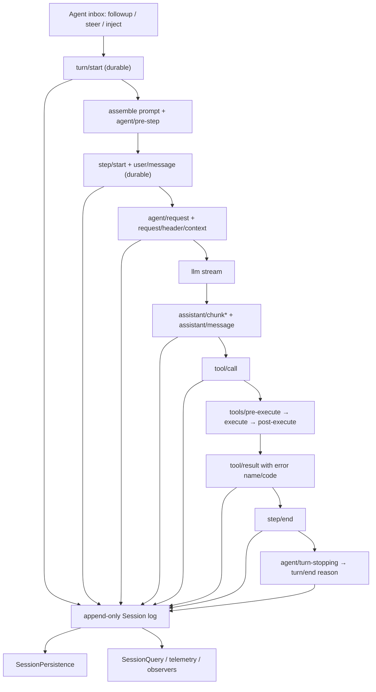

# DeepSeek Harness 源码架构与自进化接入面研究

> 历史研究说明：本文保留 2026-08-13 旧提交的核查结果，不作为新版接口规范。2026-09-19 已核查 `ddefc45` / `0.1.6-alpha.2`，候选创建、持久化与客户端接口变化见[新版兼容性核查](./2026-09-19-harness-upstream-compatibility.md)；当前实施以 1.3 技术设计为准。

> 研究对象：DeepSeek 官方仓库 `deepseek-ai/deepseek-harness`，固定到 commit [`47f943859bef60e4160492346772ded9b24f765a`](https://github.com/deepseek-ai/deepseek-harness/tree/47f943859bef60e4160492346772ded9b24f765a)（2026-08-13）。本文只描述该提交；项目仍处于 developer preview，源码和文档之间已经有少量版本差异，因此冲突时以固定提交的源码为准。

## 结论先行

DeepSeek Harness 已经具备一个自进化系统最难补造的“执行底座”：事件溯源式 trajectory、可查询的长期会话语料、结构化工具失败、显式用户反馈、运行时反射、效果可逆的插件生命周期、Agent 级能力作用域、动态插件生成与版本指针、配置 HMR，以及通用持久化域。它缺少的不是“让模型写一个插件”，而是把这些能力串成一个受控的跨会话控制面：统一经验账本、重复模式发现、组件归因、候选评估、分阶段发布、跨进程版本/审计和自动回滚。

最自然的第一阶段不是修改 `agent-loop`，也不是让动态代码直接成为永久配置，而是新增一个普通 Cordis 插件作为 **Evolution Control Plane**：只从 post-commit 信号采集经验，将派生状态写入独立 `storage-domain`，通过现有 Inspect + `cordis_define` 生成进程内候选，在独立 Agent preset / forked session 中验证，最后把通过的候选转写为普通、可审查的持久插件或 preset/profile patch。这样主 Runtime 仍保持上游原有的不变量和故障边界。

## 1. Runtime 的组成模型

### 1.1 Cordis 是运行时内核，但没有不可替换的业务“核心”

官方架构文档明确把模型适配器、工具表、Session log 和 Agent loop 都定义为 Cordis 插件；扩展方式是并列挂载插件，而不是修改一个特权内核（[docs/architecture.md L9-L13](https://github.com/deepseek-ai/deepseek-harness/blob/47f943859bef60e4160492346772ded9b24f765a/docs/architecture.md#L9-L13)）。Cordis `Context` 统一暴露 service、fiber effect、plugin 和 event API（[vendor/cordis/src/reflect.ts L208-L223](https://github.com/deepseek-ai/deepseek-harness/blob/47f943859bef60e4160492346772ded9b24f765a/vendor/cordis/src/reflect.ts#L208-L223)）。

插件注册的资源是 fiber-owned effect。一个 effect 的 disposer 会逆序执行，并且 fiber 卸载也会触发清理；重复 dispose 是 no-op（[vendor/cordis/src/fiber.ts L402-L442](https://github.com/deepseek-ai/deepseek-harness/blob/47f943859bef60e4160492346772ded9b24f765a/vendor/cordis/src/fiber.ts#L402-L442)）。Service 注册同样是 effect，卸载时删除实现并通知依赖方重新求值（[vendor/cordis/src/reflect.ts L267-L304](https://github.com/deepseek-ai/deepseek-harness/blob/47f943859bef60e4160492346772ded9b24f765a/vendor/cordis/src/reflect.ts#L267-L304)）。这使“候选能力启用—停用—重载”有统一的资源回收语义。

Cordis event 有普通 emit/serial/bail/waterfall 等模式。waterfall 中间件必须调用 `next()` 才会继续到下游/默认实现，所以可用来观察、改写或阻断行为（[vendor/cordis/src/events.ts L224-L243](https://github.com/deepseek-ai/deepseek-harness/blob/47f943859bef60e4160492346772ded9b24f765a/vendor/cordis/src/events.ts#L224-L243)）；listener 本身也是 fiber effect，会随插件卸载自动撤销（[vendor/cordis/src/events.ts L245-L301](https://github.com/deepseek-ai/deepseek-harness/blob/47f943859bef60e4160492346772ded9b24f765a/vendor/cordis/src/events.ts#L245-L301)）。

### 1.2 Profile / Bundle 是可持久化的组成层

运行实例由有序 patch 层组成：bundles → profile 的 `cordis.patch.yml` → Harness home 的 `cordis.patch.yml` → `--patch` overlay（[docs/architecture.md L15-L35](https://github.com/deepseek-ai/deepseek-harness/blob/47f943859bef60e4160492346772ded9b24f765a/docs/architecture.md#L15-L35)；实际组合代码见 [apps/cli/src/profile-boot.ts L121-L170](https://github.com/deepseek-ai/deepseek-harness/blob/47f943859bef60e4160492346772ded9b24f765a/apps/cli/src/profile-boot.ts#L121-L170)）。patch 可以按 row id 覆盖 config 或插入新插件 row，因此它是候选能力最终“晋升”为重启后仍存在配置的自然出口。

两级用户 patch 都被 watcher 监控（[apps/cli/src/profile-boot.ts L268-L295](https://github.com/deepseek-ai/deepseek-harness/blob/47f943859bef60e4160492346772ded9b24f765a/apps/cli/src/profile-boot.ts#L268-L295)）。文件变化后，`watchUserPatches()` 重新读取完整 patch 栈并对 root include 调用 `entry.update()`（[packages/boot/app-boot/src/index.ts L225-L264](https://github.com/deepseek-ai/deepseek-harness/blob/47f943859bef60e4160492346772ded9b24f765a/packages/boot/app-boot/src/index.ts#L225-L264)）。底层 `Fiber.update()` 先做配置解析/验证，再经过可 veto 的 `internal/update` waterfall，最后重启插件（[vendor/cordis/src/fiber.ts L725-L752](https://github.com/deepseek-ai/deepseek-harness/blob/47f943859bef60e4160492346772ded9b24f765a/vendor/cordis/src/fiber.ts#L725-L752)）。这已经提供配置热更新和失败显式化，但不是多候选发布系统，也没有自动生成 patch、发布门槛或回滚控制器。

## 2. 一次任务如何变成可挖掘 trajectory

官方的 turn 定义是“零个或多个 step”，每个 step 是一次模型请求加其工具调用；完整事件顺序和三类 live extension point 见 [docs/architecture.md L63-L90](https://github.com/deepseek-ai/deepseek-harness/blob/47f943859bef60e4160492346772ded9b24f765a/docs/architecture.md#L63-L90)。

具体执行中：

- 每个 `ReactLoopAgent` 创建自己的 Scope/Context，并持有 Inbox、Session 和 runtime-context projection（[packages/core/agent-loop/src/agent.ts L64-L97](https://github.com/deepseek-ai/deepseek-harness/blob/47f943859bef60e4160492346772ded9b24f765a/packages/core/agent-loop/src/agent.ts#L64-L97)）。`followup`、`steer`、`inject` 只是进入同一 inbox 的不同目标/唤醒语义（[agent.ts L113-L140](https://github.com/deepseek-ai/deepseek-harness/blob/47f943859bef60e4160492346772ded9b24f765a/packages/core/agent-loop/src/agent.ts#L113-L140)）。
- `preStep()` 先组装 system prompt/tool schemas，再把 claim 到的消息交给 `agent/pre-step` waterfall；插件可改写或拒绝输入（[agent.ts L225-L243](https://github.com/deepseek-ai/deepseek-harness/blob/47f943859bef60e4160492346772ded9b24f765a/packages/core/agent-loop/src/agent.ts#L225-L243)）。
- turn 先 append `turn/start`，每个 step append `step/start` 和实际进入模型的 `user/message`；异常被结构化为 durable `turn/end.reason = error`，取消、blocked、max-tokens 等也有独立 reason（[agent.ts L245-L330](https://github.com/deepseek-ai/deepseek-harness/blob/47f943859bef60e4160492346772ded9b24f765a/packages/core/agent-loop/src/agent.ts#L245-L330)，reason 类型见 [packages/core/session/src/types.ts L142-L177](https://github.com/deepseek-ai/deepseek-harness/blob/47f943859bef60e4160492346772ded9b24f765a/packages/core/session/src/types.ts#L142-L177)）。
- 模型流逐 chunk 落日志，随后形成 `assistant/message`；若有 tool call 则进入工具调度（[agent.ts L332-L400](https://github.com/deepseek-ai/deepseek-harness/blob/47f943859bef60e4160492346772ded9b24f765a/packages/core/agent-loop/src/agent.ts#L332-L400)）。`request/header` 还保存精确 provider/model、渲染后的 system prompt 和工具 schema，使请求环境本身可重建（[agent.ts L407-L470](https://github.com/deepseek-ai/deepseek-harness/blob/47f943859bef60e4160492346772ded9b24f765a/packages/core/agent-loop/src/agent.ts#L407-L470)）。
- Tool runtime 提供 `tools/pre-execute`、`tools/execute`、`tools/post-execute` 三个可干预 waterfall，以及 contained 的最终 `tools/result` 观察事件（[packages/core/tools/src/index.ts L142-L207](https://github.com/deepseek-ai/deepseek-harness/blob/47f943859bef60e4160492346772ded9b24f765a/packages/core/tools/src/index.ts#L142-L207)）。最终 durable `tool/result` 携带模型可见内容、`isError`，并在可得时保存稳定的 `{name, code}`（[packages/core/agent-loop/src/tool-calls.ts L261-L288](https://github.com/deepseek-ai/deepseek-harness/blob/47f943859bef60e4160492346772ded9b24f765a/packages/core/agent-loop/src/tool-calls.ts#L261-L288)）。

这意味着 prototype 不需要另造 trace SDK。它应以 `session/event` 为事实源，以 `tools/result` / `agent/error` 为低延迟补充观察点；不要把未落日志的中间判断直接当长期经验。

## 3. Session、查询与长期持久化

### 3.1 原始日志与模型表面被有意分开

`SessionEventMap` 是 merge-extensible、append-only 的事实词汇，内建 turn/step、用户消息、raw chunks、assistant message、tool call/result、request header/context 等事件（[packages/core/session/src/types.ts L230-L333](https://github.com/deepseek-ai/deepseek-harness/blob/47f943859bef60e4160492346772ded9b24f765a/packages/core/session/src/types.ts#L230-L333)）。`Session.append()` 会做 lossless-JSON snapshot、deep freeze、连续 seq 校验，先提交 log 再触发 `session/event`；观察者失败不会撤销已提交事件（[packages/core/session/src/index.ts L590-L655](https://github.com/deepseek-ai/deepseek-harness/blob/47f943859bef60e4160492346772ded9b24f765a/packages/core/session/src/index.ts#L590-L655)）。`session/event` 的公开契约也明确是 post-commit、fire-and-forget 且 observer failure contained（[index.ts L65-L85](https://github.com/deepseek-ai/deepseek-harness/blob/47f943859bef60e4160492346772ded9b24f765a/packages/core/session/src/index.ts#L65-L85)）。这是经验采集最安全的挂载点。

模型历史不是简单重放全部 raw events；`deriveMessages()` 从 surface nodes 投影当前表面，compaction replacement 会隐藏被替换节点，但原始日志仍保留（[index.ts L701-L747](https://github.com/deepseek-ai/deepseek-harness/blob/47f943859bef60e4160492346772ded9b24f765a/packages/core/session/src/index.ts#L701-L747)）。因此长期分析必须读 raw log，而不是只读当前 surface，否则会丢失已被压缩的失败细节。

### 3.2 内存 SessionStore 与 durable backend 明确解耦

`SessionStore` 明确只负责内存中的 live sessions；持久化插件订阅 `session/event` 并响应 `session/flush`（[packages/core/session/src/index.ts L786-L840](https://github.com/deepseek-ai/deepseek-harness/blob/47f943859bef60e4160492346772ded9b24f765a/packages/core/session/src/index.ts#L786-L840)）。`SessionPersistence` 的抽象契约是 durable append-only storage，覆盖 create/append/load/inspect/readFrom/list/listSnapshots，并支持 crash tail 修复和 opaque revision（[packages/session/session-persistence/src/index.ts L78-L84](https://github.com/deepseek-ai/deepseek-harness/blob/47f943859bef60e4160492346772ded9b24f765a/packages/session/session-persistence/src/index.ts#L78-L84)、[L126-L240](https://github.com/deepseek-ai/deepseek-harness/blob/47f943859bef60e4160492346772ded9b24f765a/packages/session/session-persistence/src/index.ts#L126-L240)）。因此跨进程经验扫描可以用 `listSnapshots()` 的 revision 做增量 watermark，再用 `readFrom()` 只折叠新增事件。

当前 on-disk session format 仍固定为 version 0；不承诺兼容、不提供 migration，遇到不兼容日志直接拒绝（[packages/core/session/src/types.ts L33-L56](https://github.com/deepseek-ai/deepseek-harness/blob/47f943859bef60e4160492346772ded9b24f765a/packages/core/session/src/types.ts#L33-L56)）。prototype 的经验 ledger 不宜直接依赖未来不稳定的完整 event object schema；应保存来源坐标（session id/seq/type）、少量规范化特征和自己的 schema version，并能从 raw source 重新构建。

### 3.3 SessionQuery 已经是跨会话 trajectory 的读取层

`SessionQueryEngine` 统一 live-preferred 语料，后端只需实现全文索引/排名；完整日志读取、过滤和 trace 是 backend-independent 行为（[packages/session-query/session-query/src/index.ts L74-L127](https://github.com/deepseek-ai/deepseek-harness/blob/47f943859bef60e4160492346772ded9b24f765a/packages/session-query/session-query/src/index.ts#L74-L127)）。它已经支持：

- 列出/读取完整 logical log（[L129-L151](https://github.com/deepseek-ai/deepseek-harness/blob/47f943859bef60e4160492346772ded9b24f765a/packages/session-query/session-query/src/index.ts#L129-L151)）；
- 按 session metadata、event type/time/surface/text 过滤（[L217-L255](https://github.com/deepseek-ai/deepseek-harness/blob/47f943859bef60e4160492346772ded9b24f765a/packages/session-query/session-query/src/index.ts#L217-L255)，filter 类型见 [types.ts L179-L218](https://github.com/deepseek-ai/deepseek-harness/blob/47f943859bef60e4160492346772ded9b24f765a/packages/session-query/session-query/src/types.ts#L179-L218)）；
- 读取当前 surface、追踪 parent/child lineage、event replacement/source chain，以及读取目标 event 周边窗口（[L257-L345](https://github.com/deepseek-ai/deepseek-harness/blob/47f943859bef60e4160492346772ded9b24f765a/packages/session-query/session-query/src/index.ts#L257-L345)）。

它解决“找得到长期轨迹”，没有解决“跨轨迹聚类、重复模式计数、组件归因或收益评估”。这些应作为新的派生读模型建立在它之上，而不是改写 SessionQuery。

### 3.4 已有 outcome signal 的覆盖与空洞

| Signal | 已存在 | 仍缺失 |
|---|---|---|
| Tool failure | `tool/result` 持久化 `isError` 和可选 `{name, code}`；`tools/result` 提供完整最终结果的 live observation | 同因归并、失败是否被后续 step 修复、调用参数/环境归一化、归因到 tool/policy/provider |
| Turn / model failure | `turn/end.reason` 区分 completed/error/blocked/max-tokens/aborted；request header 保存当时模型/提示/工具集 | 任务级最终成功判定、用户是否接受、跨 turn 因果链 |
| Agent self-reflection | 若反思以 assistant/user/injected message 出现，会进入 session log | 没有一等的 reflection schema、置信度、目标 component 或可执行 hypothesis |
| 用户显式反馈 | `message-feedback` 支持 message 级 positive/negative + note + CAS version（[types.ts L12-L68](https://github.com/deepseek-ai/deepseek-harness/blob/47f943859bef60e4160492346772ded9b24f765a/packages/feedback/message-feedback/src/types.ts#L12-L68)），以独立 `message_feedback` storage-domain sidecar 持久化（[spec.ts L80-L90](https://github.com/deepseek-ai/deepseek-harness/blob/47f943859bef60e4160492346772ded9b24f765a/packages/feedback/message-feedback/src/spec.ts#L80-L90)） | 反馈不在 session log；没有统一 outcome join、任务级反馈或归因 |
| Telemetry | 同时订阅 session firehose 和 `agent/error`，支持 redaction waterfall（[packages/session/session-telemetry/src/coordinator.ts L1-L12](https://github.com/deepseek-ai/deepseek-harness/blob/47f943859bef60e4160492346772ded9b24f765a/packages/session/session-telemetry/src/coordinator.ts#L1-L12)、[L79-L107](https://github.com/deepseek-ai/deepseek-harness/blob/47f943859bef60e4160492346772ded9b24f765a/packages/session/session-telemetry/src/coordinator.ts#L79-L107)） | best-effort、经过裁剪/脱敏，不应成为权威经验账本；也没有 pattern mining |

## 4. Introspection 与动态修改能力

### 4.1 运行时反射已经足够支持“先读接口，再写候选”

`tool-cordis` 注册的当前工具面包括 `cordis_inspect_list/query/self`、`cordis_define/run/stop/undefine`（源码注册见 [packages/extensions/tool-cordis/src/index.ts L34-L146](https://github.com/deepseek-ai/deepseek-harness/blob/47f943859bef60e4160492346772ded9b24f765a/packages/extensions/tool-cordis/src/index.ts#L34-L146) 和 [L148-L379](https://github.com/deepseek-ai/deepseek-harness/blob/47f943859bef60e4160492346772ded9b24f765a/packages/extensions/tool-cordis/src/index.ts#L148-L379)）。部分 README 仍描述更早的工具数量/名称，本文以源码为准。

Host inspect providers 暴露只读的 Service API、Event API、sandbox builtins 和当前 Agent 可见 Tool schemas（[packages/extensions/tool-cordis/src/providers.ts L21-L64](https://github.com/deepseek-ai/deepseek-harness/blob/47f943859bef60e4160492346772ded9b24f765a/packages/extensions/tool-cordis/src/providers.ts#L21-L64)）。`cordis_inspect_self` 可查看当前 session 拥有的动态 Plugin、所有不可变 Package 版本、current/next 指针、源码和 runtime diagnostics（[tool-cordis/src/index.ts L96-L146](https://github.com/deepseek-ai/deepseek-harness/blob/47f943859bef60e4160492346772ded9b24f765a/packages/extensions/tool-cordis/src/index.ts#L96-L146)）。

### 4.2 动态 Package 已有版本与审批，但只是进程内实验机制

动态 registry 的对象模型已经很接近候选注册表：稳定 Plugin ID 下挂不可变 Package 版本，并记录 session owner、Client approval、`currentPackageId`、`nextPackageId`、active run 和 latest attempt（[packages/extensions/cordis-host-runner/src/registry.ts L36-L70](https://github.com/deepseek-ai/deepseek-harness/blob/47f943859bef60e4160492346772ded9b24f765a/packages/extensions/cordis-host-runner/src/registry.ts#L36-L70)）。`define()` 只做元数据/语法校验并追加版本，不执行代码（[cordis-host-runner/src/index.ts L146-L202](https://github.com/deepseek-ai/deepseek-harness/blob/47f943859bef60e4160492346772ded9b24f765a/packages/extensions/cordis-host-runner/src/index.ts#L146-L202)）；包含 Client half 的首次运行可以要求用户审批（[L238-L311](https://github.com/deepseek-ai/deepseek-harness/blob/47f943859bef60e4160492346772ded9b24f765a/packages/extensions/cordis-host-runner/src/index.ts#L238-L311)）。

但 registry 明确是 **process-local**，实体只是内存 `Map` 和进程内递增 ID（[registry.ts L1-L3](https://github.com/deepseek-ai/deepseek-harness/blob/47f943859bef60e4160492346772ded9b24f765a/packages/extensions/cordis-host-runner/src/registry.ts#L1-L3)、[L140-L183](https://github.com/deepseek-ai/deepseek-harness/blob/47f943859bef60e4160492346772ded9b24f765a/packages/extensions/cordis-host-runner/src/registry.ts#L140-L183)），而且按 owning session 过滤（[L219-L226](https://github.com/deepseek-ai/deepseek-harness/blob/47f943859bef60e4160492346772ded9b24f765a/packages/extensions/cordis-host-runner/src/registry.ts#L219-L226)）。进程重启后候选源码、版本指针、审批和运行诊断全部消失；它不构成长期经验或发布仓库。

更新也不是 blue/green 原子切换。`startFresh()` 在启动目标版本前会先 `retract()` 当前 run（[cordis-host-runner/src/index.ts L823-L856](https://github.com/deepseek-ai/deepseek-harness/blob/47f943859bef60e4160492346772ded9b24f765a/packages/extensions/cordis-host-runner/src/index.ts#L823-L856)）；只有 Host/Client 成功后才把 `currentPackageId` 指向目标（[L917-L992](https://github.com/deepseek-ai/deepseek-harness/blob/47f943859bef60e4160492346772ded9b24f765a/packages/extensions/cordis-host-runner/src/index.ts#L917-L992)）。失败时旧的“current 指针”可用于手动再次运行旧 Package，但旧 run 已被拆除，并不存在自动恢复服务的事务式 rollback。

### 4.3 动态代码边界适合可信实验，不适合不可信自治发布

Host half 在 `node:vm` 中执行，并屏蔽常见 Node API、引导改走 `ctx.fs/web/bash/timer`（[packages/extensions/cordis-host-runner/src/sandbox.ts L84-L145](https://github.com/deepseek-ai/deepseek-harness/blob/47f943859bef60e4160492346772ded9b24f765a/packages/extensions/cordis-host-runner/src/sandbox.ts#L84-L145)）。guard 只暴露 effect-safe context verbs、声明过的 services 和不可直接执行现有工具 body 的 tool facade（[guard.ts L619-L655](https://github.com/deepseek-ai/deepseek-harness/blob/47f943859bef60e4160492346772ded9b24f765a/packages/extensions/cordis-host-runner/src/guard.ts#L619-L655)、[L700-L779](https://github.com/deepseek-ai/deepseek-harness/blob/47f943859bef60e4160492346772ded9b24f765a/packages/extensions/cordis-host-runner/src/guard.ts#L700-L779)）。启动失败的 child fiber 会被 dispose（[lifecycle.ts L14-L45](https://github.com/deepseek-ai/deepseek-harness/blob/47f943859bef60e4160492346772ded9b24f765a/packages/extensions/cordis-host-runner/src/lifecycle.ts#L14-L45)）。

然而源码明确声明 `node:vm` **不是 containment**，host-realm helper 仍是逃逸路径（[sandbox.ts L1-L10](https://github.com/deepseek-ai/deepseek-harness/blob/47f943859bef60e4160492346772ded9b24f765a/packages/extensions/cordis-host-runner/src/sandbox.ts#L1-L10)）；`vmTimeoutMs` 只限制同步部分，异步代码可越过它（[L216-L237](https://github.com/deepseek-ai/deepseek-harness/blob/47f943859bef60e4160492346772ded9b24f765a/packages/extensions/cordis-host-runner/src/sandbox.ts#L216-L237)）。所以它可以承载经过约束的、可信操作者监督下的候选实验，不能作为恶意/失控生成代码的安全沙箱。高风险候选仍需进程/容器级隔离和最小凭据。

## 5. Agent 作用域、preset 与候选隔离

`createScope()` 为一个 Agent 创建独立注册上下文，所有注册由该 scope fiber 所有并可整体 dispose（[packages/core/scope/src/index.ts L104-L147](https://github.com/deepseek-ai/deepseek-harness/blob/47f943859bef60e4160492346772ded9b24f765a/packages/core/scope/src/index.ts#L104-L147)）。scope event routing 允许全局 observer 看所有 Agent、某个 agent-scoped listener 只看该 Agent（[L158-L184](https://github.com/deepseek-ai/deepseek-harness/blob/47f943859bef60e4160492346772ded9b24f765a/packages/core/scope/src/index.ts#L158-L184)）。这适合把候选 listener/tool/prompt 只暴露给 canary agents。

Agent preset 是更高层的能力组合。每个 preset 挂载一次 standing composition，Agent 的 scope 通过 parent binding 加入它，从而共享其工具、prompt sections、projection 和服务（[packages/preset/agent-presets/src/index.ts L1-L20](https://github.com/deepseek-ai/deepseek-harness/blob/47f943859bef60e4160492346772ded9b24f765a/packages/preset/agent-presets/src/index.ts#L1-L20)）。新 Agent 创建前 mount，失败会回滚未发布 Agent（[L262-L288](https://github.com/deepseek-ai/deepseek-harness/blob/47f943859bef60e4160492346772ded9b24f765a/packages/preset/agent-presets/src/index.ts#L262-L288)）。composition 文件变化会让后续 sessions 使用新 generation，已加入的 sessions 继续原 generation（[L241-L252](https://github.com/deepseek-ai/deepseek-harness/blob/47f943859bef60e4160492346772ded9b24f765a/packages/preset/agent-presets/src/index.ts#L241-L252)）。这天然支持“稳定基线 preset”和“候选 preset”并存。

限制是现有 preset authoring API 只允许整目录 copy/delete，不允许调用者提交新的 composition 文本（[L361-L416](https://github.com/deepseek-ai/deepseek-harness/blob/47f943859bef60e4160492346772ded9b24f765a/packages/preset/agent-presets/src/index.ts#L361-L416)；安全理由见 [authoring.ts L1-L12](https://github.com/deepseek-ai/deepseek-harness/blob/47f943859bef60e4160492346772ded9b24f765a/packages/preset/agent-presets/src/authoring.ts#L1-L12)）。因此 prototype 若要持久生成 candidate preset，应在受控 Host 插件里建立新的审计/写入边界，而不是绕过该约束让模型直接任意写 preset。

Session 自带 fork：可从 live source 的稳定前缀创建 child，保存 `parentSession` 和 `seedLength`，并拒绝在 open turn 中间分叉（[packages/core/session/src/index.ts L1067-L1095](https://github.com/deepseek-ai/deepseek-harness/blob/47f943859bef60e4160492346772ded9b24f765a/packages/core/session/src/index.ts#L1067-L1095)、[L1097-L1135](https://github.com/deepseek-ai/deepseek-harness/blob/47f943859bef60e4160492346772ded9b24f765a/packages/core/session/src/index.ts#L1097-L1135)）。它适合构造带相同历史的验证分支，但只 fork 历史，不能自动提供同一真实外部世界或确定性工具结果。

## 6. 验证基础设施已有多少

仓库有两个可复用但不能被误解的验证部件：

1. `llm-replay` 能从 session JSONL 的 `assistant/chunk` 和明确标记的 compaction call 推导每个模型调用脚本；throw/hang 需 override sidecar（[packages/test-support/llm-replay/src/index.ts L1-L7](https://github.com/deepseek-ai/deepseek-harness/blob/47f943859bef60e4160492346772ded9b24f765a/packages/test-support/llm-replay/src/index.ts#L1-L7)、[L158-L205](https://github.com/deepseek-ai/deepseek-harness/blob/47f943859bef60e4160492346772ded9b24f765a/packages/test-support/llm-replay/src/index.ts#L158-L205)）。它很适合验证候选没有破坏控制流、事件不变量和 UI snapshot，但由于 replay 输出被固定，它本身不能证明候选能让模型产生更好的新行为。
2. `InvariantRegistry` 允许每个 package 注册归属明确的 runtime invariant，失败抛出稳定 `INVARIANT` 错误，并支持 allow/block list（[packages/runtime-diagnostics/invariants/src/index.ts L24-L65](https://github.com/deepseek-ai/deepseek-harness/blob/47f943859bef60e4160492346772ded9b24f765a/packages/runtime-diagnostics/invariants/src/index.ts#L24-L65)、[L93-L198](https://github.com/deepseek-ai/deepseek-harness/blob/47f943859bef60e4160492346772ded9b24f765a/packages/runtime-diagnostics/invariants/src/index.ts#L93-L198)）。它适合做候选的结构/生命周期 guardrail，不是行为收益评分器。

因此完整验证还需要新增：固定 holdout trajectories、可模拟/隔离的 tool/environment、任务级 outcome scorer、baseline-vs-candidate 配对比较、成本/延迟/错误率预算、canary 期持续监控和 promotion/rollback 阈值。

## 7. 最适合接入长期自进化闭环的扩展点

| 闭环阶段 | 首选接入点 | 为什么自然 | 不应直接做什么 |
|---|---|---|---|
| 采集 | 全局普通插件监听 `session/event`；需要完整 live outcome 时再监听 `tools/result`、`agent/error` | 都是公开 seam；`session/event` 已 post-commit 且 observer failure contained | 不在 `agent-loop` 内加入经验写盘；不让采集失败阻塞 turn |
| 补充显式反馈 | 读取 `messageFeedback` sidecar / 监听 `domain/changed` 中 `message_feedback` | 已有 durable、versioned 反馈事实 | 不把 UI telemetry 当权威反馈 |
| 增量长期扫描 | `sessionPersistence.listSnapshots/readFrom` 或 `sessionQuery` | 有 revision/watermark、完整 raw log、filter/search/lineage | 不只读 compacted surface；不复制另一套 session store |
| 经验/假设/候选账本 | 新的 versioned `storage-domain` | durable-first write、schema validation、通用 [JSON](https://github.com/deepseek-ai/deepseek-harness/blob/47f943859bef60e4160492346772ded9b24f765a/packages/storage/storage-json/src/index.ts#L1-L65) / [SQLite](https://github.com/deepseek-ai/deepseek-harness/blob/47f943859bef60e4160492346772ded9b24f765a/packages/storage/storage-sqlite/src/index.ts#L1-L77) backend；相关不变量见 [storage-domain/src/domain.ts L1-L8](https://github.com/deepseek-ai/deepseek-harness/blob/47f943859bef60e4160492346772ded9b24f765a/packages/storage/storage-domain/src/domain.ts#L1-L8) 和 [spec.ts L34-L44](https://github.com/deepseek-ai/deepseek-harness/blob/47f943859bef60e4160492346772ded9b24f765a/packages/storage/storage-domain/src/spec.ts#L34-L44) | 不往原 Session log 塞大量跨会话派生状态；log 应保存事实/引用而非可重算索引 |
| 组件定位 | 组合 request header、tool schema/name/code、turn reason、event windows、Inspect 的 Service/Event/Tool catalog | 能把问题映射到 prompt/tool/policy/provider/loop 等 component seam | 不让一次 reflection 直接决定修改目标；需要证据计数和不确定性 |
| 候选生成 | `cordis_inspect_*` → `cordis_define` 新 immutable Package | 模型先读真实运行时契约；旧版本保留，语法先检 | 不把 process-local registry 当长期版本库 |
| 候选作用域 | agent-scoped registration 或独立 candidate preset；必要时独立进程 | 可限制仅 canary Agent 可见，且整体 dispose | 不在全局 host composition 直接试高风险 listener/service replacement |
| 离线验证 | session fork + candidate preset + replay/snapshot/invariants + 自建 outcome scorer | 复用历史/事件验证和 package invariants | 不把固定 LLM replay 的“通过”解释为行为提升 |
| 发布 | 生成普通可审查插件 + profile/preset patch；由受控 Host promoter 原子写入并让 HMR 应用 | 跨重启、现有 config validation/HMR、用户可见可编辑 | 不允许模型直接写任意 `cordis.patch.yml` 或覆盖已知稳定插件 |
| 回滚 | 保留 immutable artifact + promotion manifest；切回上一 profile/preset generation | 与上游组成模型一致 | 不只回拨 `currentPackageId` 指针；它不保证旧 run 仍在运行 |

## 8. 已存在能力与关键缺口

### 已存在，可直接复用

- 事件溯源的完整 trajectory，含 request environment、raw model stream、结构化 tool errors 和 turn outcome。
- JSONL/SQLite 等 Session persistence、revision/read-from 增量读取、crash repair。
- 跨 live/persisted Session 的 query、filter、全文检索、surface/source/lineage trace。
- message 级正负反馈 sidecar 和 telemetry/agent-error 辅助信号。
- Prompt/tool/request/turn 的公开拦截 seam；不用 fork loop。
- Cordis service/event/effect reflection、可逆 plugin fiber、依赖热重载、配置 HMR。
- Agent scope、preset generation、Session fork，能构造受限 canary。
- 动态 Plugin 的 inspect、不可变 Package 版本、审批、运行诊断和人工可触发 rollback。
- 通用 versioned storage-domain，可承载新的跨会话 control-plane 状态。
- replay、snapshot 和 package-owned invariants，能覆盖结构性回归。

### 缺失，必须由 Continually Self-Evolving Harness 补齐

1. **统一经验模型**：Session events、message feedback、telemetry、reflection 和外部 outcome 仍是分散数据源，没有 canonical Experience / Outcome / Evidence schema。
2. **长期模式发现**：没有跨 session 的增量特征折叠、聚类/去重、频次/趋势、success pattern 或修复后复发检测。
3. **Harness component attribution**：没有把证据映射到 prompt section、tool、pre/post policy、provider、preset、loop 等 seam 的责任模型，也没有归因置信度。
4. **候选与证据的可追溯关系**：动态 Package 只有 name/purpose/source 和 latest attempt，没有 hypothesis、supporting event refs、baseline、author/model、生成配置、风险级别和预期指标。
5. **持久候选仓库**：动态 Cordis registry 完全 process-local；重启即丢，不能承担长期 version management。
6. **行为评估器**：现有 replay/invariants 只能证明确定性执行和结构不变量，没有任务级成功、质量、成本、延迟、安全和回归的综合评分。
7. **分阶段发布**：没有 offline → shadow → canary → promoted 的状态机、流量/Agent 分配和置信门槛。
8. **原子更新与自动回滚**：动态 update 先拆旧 run；profile HMR 是配置热更新而非带 SLO 的 deployment transaction。没有持续监控触发的自动恢复。
9. **跨进程隔离和安全**：`node:vm` 不是安全边界；候选可调用被注入的真实 services。高风险自生成代码需要 OS/process/container 级隔离、凭据缩减和 egress policy。
10. **治理与审计**：没有谁能生成、谁能验证、哪些改动需 human approval、多久过期、如何撤销的策略；也没有不可篡改的 promotion decision log。
11. **格式演进**：Session format 尚为 v0 且无 migration；长期 control plane 必须自带 schema version/migration/rebuild 策略。

## 9. 对第一阶段 prototype 的源码约束建议

为证明“长期真实经验能否转化为可验证、可保留的 Runtime 改进”，建议把范围限制在以下边界：

1. **只处理三类高精度证据**：相同 tool `{name, error.code}` 的重复失败；`turn/end` 的 error/max-tokens；带 note 的 negative message feedback。先不做开放式“所有轨迹都让 LLM 反思”。
2. **只允许四类候选**：新增/修改 prompt section、tool wrapper、一个新 tool、`agent/*`/`tools/*` policy listener。禁止改 agent-loop/session-persistence/approval/sandbox/credentials。
3. **经验账本与 Session 解耦**：一个新 storage-domain 保存 `ExperienceCluster`、`Hypothesis`、`Candidate`、`EvaluationRun`、`Promotion`，所有记录引用 session id + seq，不复制整段敏感 trajectory。
4. **候选先 process-local，晋升才持久化**：Inspect + dynamic Package 只用于快速试验；通过后生成普通插件 artifact 和 candidate preset/profile patch，进入代码/配置审查。动态 Package 本身不自动“转正”。
5. **至少两道验证门**：离线 replay/invariant/snapshot 门验证不破坏结构；隔离 candidate preset 的真实/模拟任务门验证相对 baseline 的 outcome。二者都通过才进 canary。
6. **canary 以新 Agent 为边界**：利用 preset generation 让新 sessions 进入候选，现有 sessions 保持旧 generation；不要 mid-conversation 换能力集，因为上游也明确警告换 preset 会让已记录 tool calls 与新 composition 不一致（[packages/preset/agent-presets/src/index.ts L437-L452](https://github.com/deepseek-ai/deepseek-harness/blob/47f943859bef60e4160492346772ded9b24f765a/packages/preset/agent-presets/src/index.ts#L437-L452)）。
7. **发布默认要求人工确认**：prototype 可以自动发现、归因、生成、验证并提出 promotion，但持久写 profile/plugin 需要 human approval。待隔离、评估和审计成熟后再讨论低风险类别的自动晋升。

## 10. 关键源码索引

| 关注点 | 关键符号 / 文件 |
|---|---|
| Runtime 组成与事件图 | [`docs/architecture.md`](https://github.com/deepseek-ai/deepseek-harness/blob/47f943859bef60e4160492346772ded9b24f765a/docs/architecture.md#L9-L128) |
| Cordis 可逆 effect、reload、update | [`Fiber.effect/getEffects/restart/update`](https://github.com/deepseek-ai/deepseek-harness/blob/47f943859bef60e4160492346772ded9b24f765a/vendor/cordis/src/fiber.ts#L402-L572) |
| Agent turn/step/request loop | [`ReactLoopAgent`](https://github.com/deepseek-ai/deepseek-harness/blob/47f943859bef60e4160492346772ded9b24f765a/packages/core/agent-loop/src/agent.ts#L64-L495) |
| Tool 执行与观察 seam | [`ToolRuntime Events`](https://github.com/deepseek-ai/deepseek-harness/blob/47f943859bef60e4160492346772ded9b24f765a/packages/core/tools/src/index.ts#L137-L208) |
| Durable trajectory vocabulary | [`SessionEventMap`](https://github.com/deepseek-ai/deepseek-harness/blob/47f943859bef60e4160492346772ded9b24f765a/packages/core/session/src/types.ts#L230-L333) |
| Append commit boundary / surface projection | [`Session.append/deriveMessages`](https://github.com/deepseek-ai/deepseek-harness/blob/47f943859bef60e4160492346772ded9b24f765a/packages/core/session/src/index.ts#L590-L747) |
| Durable Session backend | [`SessionPersistence`](https://github.com/deepseek-ai/deepseek-harness/blob/47f943859bef60e4160492346772ded9b24f765a/packages/session/session-persistence/src/index.ts#L78-L240) |
| 跨会话读取/过滤/trace | [`SessionQueryEngine`](https://github.com/deepseek-ai/deepseek-harness/blob/47f943859bef60e4160492346772ded9b24f765a/packages/session-query/session-query/src/index.ts#L74-L357) |
| Agent 隔离 | [`createScope/scopeTarget`](https://github.com/deepseek-ai/deepseek-harness/blob/47f943859bef60e4160492346772ded9b24f765a/packages/core/scope/src/index.ts#L104-L184) |
| Candidate composition | [`AgentPresets`](https://github.com/deepseek-ai/deepseek-harness/blob/47f943859bef60e4160492346772ded9b24f765a/packages/preset/agent-presets/src/index.ts#L241-L337) |
| Introspection / dynamic modification tools | [`tool-cordis apply`](https://github.com/deepseek-ai/deepseek-harness/blob/47f943859bef60e4160492346772ded9b24f765a/packages/extensions/tool-cordis/src/index.ts#L34-L399) |
| Process-local candidate versions/runs | [`DynamicCordisRegistry`](https://github.com/deepseek-ai/deepseek-harness/blob/47f943859bef60e4160492346772ded9b24f765a/packages/extensions/cordis-host-runner/src/registry.ts#L36-L226) |
| Dynamic activation / update semantics | [`DynamicCordisRunnerService`](https://github.com/deepseek-ai/deepseek-harness/blob/47f943859bef60e4160492346772ded9b24f765a/packages/extensions/cordis-host-runner/src/index.ts#L810-L992) |
| Dynamic code trust boundary | [`sandbox.ts`](https://github.com/deepseek-ai/deepseek-harness/blob/47f943859bef60e4160492346772ded9b24f765a/packages/extensions/cordis-host-runner/src/sandbox.ts#L1-L237)、[`guard.ts`](https://github.com/deepseek-ai/deepseek-harness/blob/47f943859bef60e4160492346772ded9b24f765a/packages/extensions/cordis-host-runner/src/guard.ts#L619-L819) |
| Control-plane 持久状态 | [`storage-domain`](https://github.com/deepseek-ai/deepseek-harness/blob/47f943859bef60e4160492346772ded9b24f765a/packages/storage/storage-domain/src/domain.ts#L1-L119) |
| 显式用户反馈 | [`message-feedback`](https://github.com/deepseek-ai/deepseek-harness/blob/47f943859bef60e4160492346772ded9b24f765a/packages/feedback/message-feedback/src/types.ts#L12-L68) |
| 配置持久化 / HMR | [`profile-boot`](https://github.com/deepseek-ai/deepseek-harness/blob/47f943859bef60e4160492346772ded9b24f765a/apps/cli/src/profile-boot.ts#L121-L170)、[`watchUserPatches`](https://github.com/deepseek-ai/deepseek-harness/blob/47f943859bef60e4160492346772ded9b24f765a/packages/boot/app-boot/src/index.ts#L225-L264) |
| 结构验证 | [`llm-replay`](https://github.com/deepseek-ai/deepseek-harness/blob/47f943859bef60e4160492346772ded9b24f765a/packages/test-support/llm-replay/src/index.ts#L1-L205)、[`InvariantRegistry`](https://github.com/deepseek-ai/deepseek-harness/blob/47f943859bef60e4160492346772ded9b24f765a/packages/runtime-diagnostics/invariants/src/index.ts#L93-L198) |
